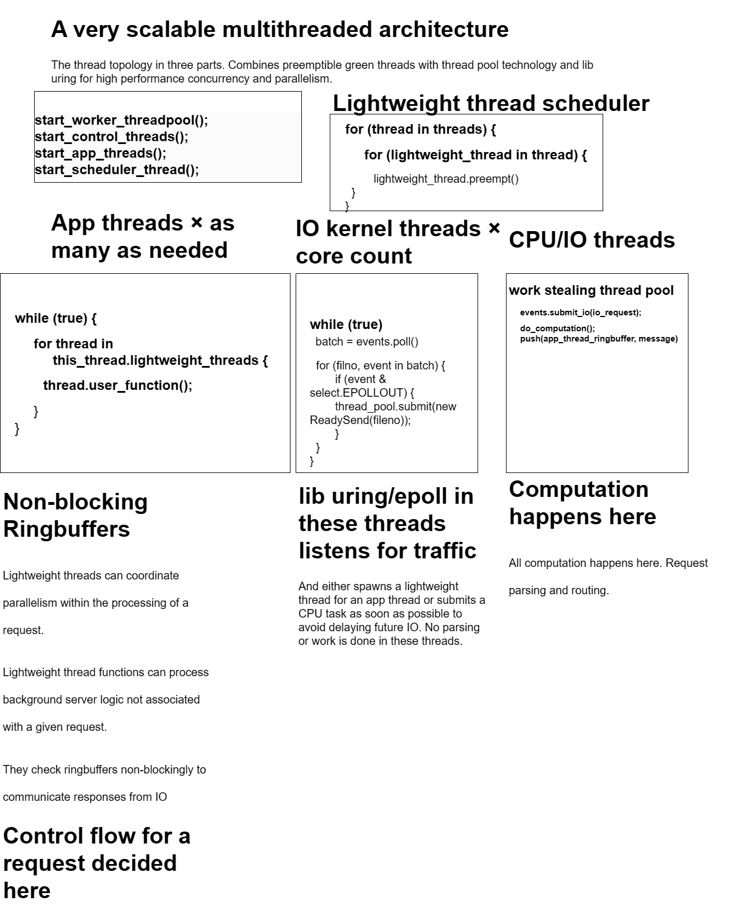

# ideas5
Welcome to the fifth batch page of my Ideas for Computing. This is a stream of my thoughts while working on computers with the theme of integration and improvement of how computers work.

 * See [100 Ideas for Computing](HTTPS://GitHub.com/samsquire/ideas), the first issue of this series.
 * See [ideas2, Another 85+ Ideas For Computing](HTTPS://GitHub.com/samsquire/ideas2)
 * See [ideas3, An Extra 100 Ideas for Computing](HTTPS://GitHub.com/samsquire/ideas3)
 * See [ideas4, Additional 100+ Ideas for Computing](https://github.com/samsquire/ideas4)
 * [Follow me on Twitter](HTTPS://twitter.com/mrsamuelsquire)
 * Looking for business ideas? Checkout my [startups repository](https://github.com/samsquire/startups) where I list business ideas.

<a rel="license" href="http://creativecommons.org/licenses/by-sa/4.0/"></a><br />This work is licensed under a <a rel="license" href="http://creativecommons.org/licenses/by-sa/4.0/">Creative Commons Attribution-ShareAlike 4.0 International License</a>.

# 1. Dynamic type crystallization

Any variable can contain any type of data, but once it is set to a type, its type cannot be changed to another type. Our adaptive or specialised compilation can flip to a specialised case with this rule and it never needs to hit a slow path except the first time.

# 2. Matrix multiplication on matrixes of movements of identities

Matrix multiplication is very useful, but what if matrix multiplication can be useful with the movement of identities through a program space? A matrix multiplication is similar to a breadth first search and a rotation.

# 3. VLIW software

# 4. Orthogonality and nested placement relationships and rules

When we move things around, we may also want to move them according to a multiple rules simultaneously.

# 5. No matter how small or large the task, it composes and parallelises well

Imagine you're writing a web scraper, there are multiple steps in the procedure to scraping that need to be efficiently multitasked and scheduled. It would be nice if the unit of parallelization could be scaled up and down based on the characteristics of the calculation.

# 6. Internet triggered soft upgrade

Soft upgrade is a virtual upgrade but not an actual upgrade. In-place pauseless and synchronized upgrades

# 7. Code maps

A standardised syntax for describing behaviour, used as a comment to find code easily.


```
```

# 8. Can Graph thinking solve logic puzzles quicker?

# 9. Linux single sign in

# 10. Orthogonality of stacks and joins

`callCC` and delimited continuations.

# 11. GUI state container

What's a GUI container? A GUI container is similar to the active memory of a REPL. It interprets the objects in memory and tries to render them in an attractive way that makes sense.

We can use type systems to define what state the GUI should be in. The GUI container is an object area that receives collections of objects and decides how to render them. The behaviour of the application is defined by the types.

# 12. Beautiful API first

The beautiful API is more important than even efficiency, and in theory a properly designed API can have hints, for compiling for a more performant solution.

# 13. Data method calls

Data only, they insert data or associations with an object, not run code.

# 14. Dynamic compiled

In Ruby on Rails, methods are created automatically, at run time to provide features. Couldn't we generate these method calls at compile time.

# 15. Everything is brittle and breaks all the time

# 16. Imaginary framework

# 17. Custom patches part of the package manager

It should be easy to apply custom patches to code and package it easily, the build pipeline should support it.

# 18. Changing software is extremely painful

# 19. Non ASCII tokens direct parse-to-parse mapping

This idea is based on using assembly as an output language for a compiler. Using text output is extremely elegant API for code but is not very efficient due to the requirement to serialize and parse, especially for something such as a JIT compiler that needs to compile frequently and as fast as possible. It is inefficient to generate/emit streams of text that shall only be parsed again by the assembler.

What if we could skip the text component and communicate binary directly between the part that serialises and the part that deserialises but still maintain the textual API from the programmer's perspective? 

Instead we turn textual tokens into an compile time API, in other words the compiler encodes the tokens of the lexer into a binary protocol. This way the assembler can skip parsing because it has the data structure already in binary.

Rather than writing code that parses ASCII at runtime, we want to remove the code of the code that actually serialises and deserialises ASCII to tokens, instead our compiler accepts an assembly-like syntax at compile time, which is then turned into correct calls into the assembly runtime, skipping parsing of text.

What if there was a compile time API that looked like this but actually mapped to binary API at compile time, rather than runtime?

```
_loop:
	# yield to the coroutine
	YIELD
    sub $8, %rsp
    pushq %rax
    pushq %rcx
    pushq %rdx
    pushq %rbx
    pushq %rbp
	leaq	.LC9(%rip), %rax
	movq	%rax, %rdi
    movl    %edx, %esi
	movl	$0, %eax
	call	printf@PLT
	movl	$0, %eax
    popq %rbp
    popq %rbx
    popq %rdx
    popq %rcx
    popq %rax
	# i += 1
	inc %rax
	# move onto the next coroutine
	add $32, %rcx
	# Loop things
	cmp $10, %rax
	jl _loop
	jmp _exit

	# popq	%rbp
    ret
```


# 20. Snippet LISP

Break LISP into named blocks and compose them together, avoid nested LISP confusion.

I don't like seeing `))))))` in my LISP code because I don't know which one to insert between to insert into the right part of the AST tree. So I would combine my lisp with equal statements.

```
if_recur = (if (< i (count lines))
					(recur inext)
					-1)
					)

line_equal = (if (= (nth lines i) "ec2-18-130-242-27.eu-west-2.compute.amazonaws.com")
				 i
				if_recur)

find_host_index = (let [node_data (slurp "nodes") 
	 lines (str/split node_data #"\n") 
	 index (loop [i 0]
		(let [inext (+ i 1)]
			line_equal) ]
	(println index)
					)
					
try_block = (try 6
           (catch Exception e 
                  (println e)
                  nil))
                  
next = (loop []
  (or try_block
      (recur)))
```

# 21. Protocols are surprisingly complicated

# 22. Elegant protocols

# 23. Timing

# 24. Rich runtime applied to network protocols

The network protocol is essentially a set of processes, of state machines that are independently scheduled.

# 25 Expected things to do with a protocol

We should never get into a state where the server crashes or we get broken pipe.

# 26. Giant statemachine

The state of the remote server, the state of the active server and the state of the data being sent back and forth.

# 27. Common coding errors

Did you turn off the thing that isn't working? Did you shut down the server

Did you change the right object?

Did you do the thing inside or outside the loop?

is your loop try and except the right way round?

# 28. Distributed Match states, Connected everything, assert on anything


# 29. Search imports

# 30. Standard consideration mitigation

There's a batch of considerations to be considered when building a system, for example, is latency low even after continual usage?

# 31. Good targets

* 10,000 connections
* 1000MBs per second
* 100s of producers
* 100s of consumers
* 100s of applications on one container
* 600,000 requests per second
* Efficient with Billion records

# 32. Promises - When numbers are equal

We can implement promises and mutual exclusion with numbers that are either equal or not equal. Do this thing when these numbers are equal.

# 33. Bit mask scheduling

# 34. Statelines diagram

Draw statelines which show transit of values through system rather than progression of logic.

# 35. The pedanticness of a fair benchmark should be incorporated into product design

Many companies deny benchmarks of their software. 

# 36. Robust package management ideas

Package managers get into strange states.

# 37. Data defines the software

# 38. Breaking a computation across machines, chunk computation

How do you divide any arbitrary computation across boxes, for data sizes that are beyond any given box?

Threads, multithreading, sharding, and computation larger than a single machine

# 39. Language should have efficient automatic serialization

# 40. Data shipping home

Trivially easy data migration pipelines.

# 41. Markdown to crud website

# 42. Behavioural resources

Create resources similar to CRUD that have behaviours.

# 43. The Bottom Abstraction - Composing behaviours is a huge problem

When building a system, it is often helpful to have a bottom abstraction, that other things are based upon. What's the bottom abstraction anyway? How do you compose behaviours?

* I want data to be migratable easily from machine to machine, from a graphical user interface.
* I want IO and CPU computation to be parallelisable
* In LISP it is lists and trees.
* Instruction Set Architecture is instructions to do mathematical operations and move things around memory and move through instructions.

# 44. Reverse log to AST tree, state transition events to state machine

Log to reverse tree to work out logic order.

State machine code from events

# 45. Coordinated runtimes

After looking into liburing, it occurred to me that behaviours of systems should be generalised for the best possible performance.

# 46. It's impossible to segfault if we know the range of what is valid

Because you import what you use and what you expect to be where and what you expect each data structure to contain. It's not possible to dereference a value to an invalid piece of memory.

Parsing associated with blocking.

# 47. Can we infer the movement through instructions?

# 48. Monetisation system

Monetization doesn't need to ruin a website.

# 49. Complete program, separated into pieces, re-stitched together into new program

Imagine you have a complete program that does a task and we want to do a variation of what the existing program does. We can do a simple transformation to get the program into a form that we can extend:

* inline all internal methods until only platform calls exist
* label parameters that pass through the program through to these platform/system calls and give them a type
* accept, recv, send loop


can tweak relationships of the task, mix and match the code to do what we want.

For example, a simple uring program can act as a webserver and send data to clients.

Can add threading and cross thread communication to different pieces of code.


rich runtime can be used to distribute processing too

synchronization is just loops


# 50. Hierarchy of event loops

raise to previous event loop, state machine coordination

# 51. Render the code differently, simplified rendering of code

# 52. Complicated behaviour made easy

can think about raft and state machine futures easily

# 53. Graph inflection points

scheduling is an inflection point on a wave function

# 53. Structure of code references that are useful

What is the shape of the program?

# 54. Parameterless programming

Chain together methods, define relationships as links that pass through the program. The important thing is the chaining together of methods.

# 55. Roleplay language and pattern matching global state

Instantiate objects and create roles to play.

# 56. Stateful circle, programs on rails

With stateful programs, it can be difficult to reason about them when there are interactions between different actors or nodes. This idea is that we represent all actors in the systems as circles, which always progress forward. We define circles for each actor and circles for overall progress. We link states between circles together which form valid pathways of execution.

* We define a schema of the presence of facts and the progression through different facts.
* Any progression backwards is an invalid state, which means there is a bug in the program.
* An unexpected state change is a bug.
* You could say that state is montonically increasing at all times.
* No matter what interactions with other objects, all circles shall turn forwards.
* Can use logical clocks to identify causality.
* Numbers that increment are new states.
* When global state is checked, that is communication with a global actor, presumably under a lock.
* We can output logs of each thread periodically and analyse the logs to see if the schema was maintained.
* Trapped state detection: No path of state associations back to the global circle, so it's impossible for the circle to move forward.
* You must write a determine state function to determine the facts about the system at the current time. Concurrent events are represented.
* Can create incremental state machines which are snapshots of valid cases, which are stitched together.

For example, we want to schedule two actors, A 5 times and B 5 times and run them alternatedly. AAAAABBBBBAAAAABBBBBAAAAABBBBBAAAAABBBBBAAAAABBBBB,

The "dot" symbol is a "join" from one state to another state. State changes are atomic because processing is evaluated before scheduling time.

```
global = actor(A).scheduled actor(!A).not_scheduled | actor(B).scheduled actor(!B).not_scheduled | regenerate

actor(A-B) = scheduled submitted++ | submitted == total | completed reset submitted = 0 | not_scheduled
```

This can be read as the following:

```
When the actor(A) is scheduled, every actor that is not A is not_scheduled.
Actors that are scheduled are submitted++ until submitted == total and then submitted is set to 0 and they are not_scheduled.
```


Concurrent state changes

Must define a function for each actor and global state: 

Can write a test that tests state and then checks if the state is valid progression, according to the schema.

Guaranteed to make progress.

State explosion.

Desired outcome: alternated scheduling of ABABABAB

```
range submitted..locks

```

interactions between things, what happens next

```
a1 a2 a3 b1 b2 b3

```


special cased work - throwing effort at the problem

legilislational hardness

# 57. Code focus

Enable/disable log lines after running and show/hide log lines that came from there.

# 58. A database is hard to change

# 59. OpenConsult

# 60. Product mixer

I have a number of skills that can be mixed together to produce something useful. But alone I can only do so much unless I push through unchartered territory. Wouldn't it be good if we could define our skills and our operations and allow others to communicate with us to mix things into new products?

Could use LLMs too.

# 61. High level low level concern mixing, whenever syntax

How do you mix high level and low level concerns?

High level specification of what should happen, high level logic:

```
checkout-button | review-basket | checkout | sign-in-or-guest-checkout | delivery-address | delivery-options | payment-detils | place-order | payment | send-order-confirmation 
```


Low level specification of what should happen, low level logic,

weave them together

* when "sending an api request", "write it to the write ahead log"

# 62. Calculation complexity score

A computation specification language that includes a complexity score.

* round trip times
* thread synchronizations
* amount of data
* amount of records

# 63. Concurrent hash join

Multiple users are doing the same query, we can share the large table.

# 64. Markdown GUI format

# 65. Exclusive content

# 66. Logic of the kernel

# 67. Readable code

# 68. Turing complete is the golden standard

But we want to do is constrain turing completeness without constraining it.

Such as a builder pattern, to define what should happen when. We want to configure something. To compile it.

Builder pattern that maps to assembly.

Declarative, imperative, something new.

We seem to want to 


# 69. New versions breaking code

# 70. Marketing and demand matching is an unsolved problem

# 71. Event loops and coroutines

# 72. Is assembly might not be the lowest common denominator

# 73. Scheduled Collective Attention

Attention is qualified.

# 74. Code supported by one person is not dependable


# 75. Cache invalidation and GUIs

# 76. Per programming project information system

# 77. Dispatch/Jumping around intelligently more valuable than actual mathematical operations on a CPU

For example, all the methods that must be called in the right order to create a GUI.

# 78. API State machines

Each API call is a mini process with a behaviour.

This could be combined with Overstates.

# 79. Omnichannel distributed system

Frontend and backend cordinated from same codebase.

There was a Haskell project that seamlessly transferred state between frontend and backend but I don't think it was a distributed system. I don't remember what it was called.

Writing APIs to glue together data fetching and actions and GUI state is all very siloed. If you could talk about the system as a whole including GUI interactions at the same time as system interactions that could be truly powerful.

Imagine multi *omnichannel* event streams that map to the users notifications, email inboxes, chat interface, post, deliveries, accounting, customer data, synchronisations, integrations, microservices and business CRM and ERP. Everything is linked together by powerful workflows. An interaction with a customer is just an extension of the system. It's a distributed system of human tasks as well as digital tasks and interactions between the customer and the company.

# 80. The Wiring shouldn't matter

What's important is the sequence of behaviours that should follow on from eachother.

# 81. Coordinates 

# 82. State machine GUI

Use the state machine syntax to define the behaviour of the GUI.

# 83. Community Idea: Fake the App

# 84. State machines in assembly, error handling and structure sizes and attacks 

# 85. GUIs at X11 layer

# 86. Refresh logic in everything, Promise Lattice

I read [this account on Hacker News about a GUI that was written in assembly](https://news.ycombinator.com/item?id=36153989) and it made me think of promises in GUI rendering.

# 87. Literal linear synchronized in memory buffers for everything (linear memory and execution)

Computers are linear with sporadic jumps. 

I don't know how it works: exceptions at the assembly layer.

# 88. Syscalls and function calls

# 89. What you see is how it is organised in the computer

# 90. Subscribe to blogger

# 91. Attention camping

Attention is extremely important and valuable in the internet world, it determines who you buy from and who you are influenced by. This idea is a website where you create a description of what you want attention for and then you camp (which means wait) for a match up with someone who wants to pay attention to it, based on a matching algorithm. When there is a group of 10 people who want to pay attention to something, it opens up the item and people can chat and interact on that item.

Centrally plan your attention based on what you want to pay attention to rather than browsing or doomscrolling.

Create an extremely deep profile of what you want to pay attention to, what you think is interesting and everything you find interesting.

We can use large language models to compare similarity of everyone's profiles with other people in vector/embedding space.

Create items that you want to share with others and when a critical mass of people reach the same item, then an item is created and everyone is notified that they want the same thing.

This is an asynchronous community, like email waits for someone to reply.

# 92. Offline IT, Designed to be down

# 93. The C/C++ project building approach doesn't work

You need to use Bazel or Buck or something serious to do anything properly.

# 94. Refresh rate GUI state

Creating GUIs is extremely difficult because of state management. If we express what the new state should be, a virtual DOM diffs it and decides how to make the old state match the new state.

# 95. Wait state deschedules

We want to avoid polling, so we have a wait command which deschedules the lightweight thread until it is finished. This is a bit like IO but results in a powerful direct style. This is similar to sleep but evented.

```
while True:
    events = event_context.poll();
    for event in events:
        case event.type:
            case TYPE_EVENT: // handle event
                event_context.add_wait("NEXT_STATE")
                
                
```

We can use promises or async await for this pattern!

# 96. Online multiplexing

The simplest multiplexing is a loop. But we can do it as an online algorithm and separated in time, across processes.

# 97. Constraints game

Rust lifecycles and borrow checker are rather complicated to learn.

# 98. Extracted pricing

Itemized pricing

# 99. Diagram the spirit of problems in language

# 100. Metaast

A Java solution to doing something in plain English of the problem to be solved looks different to the same in Rust.

Metaast is the creation of an AST of problems with a simplified configuration model that can transpile to Rust or Java.

# 101. Locks in state machine formulation

If these processes go in parallel:

```T
process-1 = action1 | shared_resource action2
process-2 = action3 | shared_resource action
```

They shall automatically be scheduled so that locks are around the things that need to be protected.

# 102. Parallel GUI visualisation

A GUI where you can see parallel state machines executing and interleaving.

# 103. Log hash

A loghash is a configuration that leads to the output of particular kinds of logs.

Can be stored in a text file and changed with command line tools.

# 104. Isomorphic state machines

This state machine formulation can be executed on the server, on different threads, on different servers as microservices, as different routes, as protocols, on the web browser and in Javascript workers, in WASM and the communication is handled for you, automatically.

```
```

# 105. Recursive descent parsing data fetching (ala GraphQL)

# 106. Composition of APIs

We can schedule behaviour by moving blocks of lexer tokens around

Need a GUI that looks like a Outliner that can move tokens and reorder them around. Can customise behaviour.

Parsing IS composition. Combine two libraries together with a lexer.

Tie together states in each application.

If I have the behaviour as token stream of two programs, then I interleave them, so I need elegant way to do concurrent programming and wait states between different behaviours of each part.

Substates of other programs behaviour, or instances of behaviour?

```
```

Logical clocks, causality marked by thread ID

# 107. Concurrency hoisting

I want to be able to write the following code, where I can include a blocking function anywhere, but it shall never block the event loop of the current thread.

```
hoist while (true) {
	batch = poll events
	for (item in batch) {
		switch (item.type) {
			case EVENT_A:
				blocking_function(); 	# <---- THIS LINE DOESN'T BLOCK THE EVENT LOOP
				call_function_after(); 	# <---- BUT THIS LINE HAPPENS AFTER
				break;
		}
	}
}
```

# 108. Parallel game engine

# 109. Golden concurrency

It should be possible to write to the same database from 3 processes all running as fast as they can without needing to separate the database into three databases and updating them separately.

# 110. Funding IT

# 110. Easy online

A way of configuring a server so it that can come online quickly and join the network.

Platform logic and my programming language and server software runtime should do this. Reliable autoconnect logic.

# 111. Overlaid chunking/buffers

Chunking can be overlaid some existing code for performance, without needing to redesign the underlying implementation.

If I have a complicated algorithm, how do I postprocess the code to add chunking? Do I insert loops everywhere?

# 112. Elastic hierarchies

A function that grows complicated graphs according to a progression, like a mathematical set.

This can be implemented to implement [ideas4 132. Revenue Scaling Plan](https://github.com/samsquire/ideas4#132-revenue-scaling-plan).

# 113. Implementation Freedom

Macros of AST transformation really are a way for implementation freedom, but what about orthogonality?

I talked about is assembly the lowest common denominator.

# 114. Unfair selects in Go

In Go there is a selector operator.

If I have events of different rates, I might want to define a SLA for processing events of each source, in effect I schedule the multiplexing of each channel. This is sampling.


# 115. Multithreaded Runtime architecture Asynchronous and Nonblocking runtime

How do you write a program that never blocks and where everything is asynchronous?

One approach is to separate control and work.



This design incorporates 3 layers of threads for non-blocking high performance. Nonblocking Ringbuffers are used everywhere.

* **App threads**: No IO or CPU is done in these threads. These coordinate IO and CPU use in the background to the application. They are not associated with a particular request but application state. Change detection happens here.
* **Control threads** This is where liburing or epoll is used. This is a simple routing dispatcher and no IO actually goes on.
* **CPU/IO Thread pool** Work actually happens here and communicates to the application with ring buffers or submitting IO requests.

This design would actually work in a programming language implementation interpreter. The worker thread pool can be sent the context of the function to be executed.

Need to work out how to combine the state machine formulation into this pattern.

# 116. Compatible types

# 117. Collection classes - what should the behaviour be when there's multiple?

Multiply/pluraize behaviour upwards in the stack.

# 118. Template pattern programming

I have a model of system that I want a programming language to compile into. How do I do this?

# 119. The architecture of a web server

The ergonomics of configuring a web server are interesting. Flask, express and Spring Boot take different approaches to configuring web server listeners. Spring Boot uses annotations, flask uses decorators and express uses function calls and callbacks.

I feel configuring a web server to route traffic to code is an information system problem. 

# 120. GUI Assurances

This should never overlap this.

# 121. Compiled dispatch rule engine in a web server

What should happen when.

# 122. Need a C API AST

I want to be capable of generating C code with an API.

# 123. Do nested expressions have value?

```
something(other(another()));
```

# 124. The data structure of code

# 125. Advanced flexible resolution

Resolution is such an underspecified thing. What does every package management solution do and build process look for things? 

* Puppet's Hieradata is an advanced resolution mechanism but is used for a specific purpose.
* C++ templates are a resolution algorithm

# 126. SIMD buffered request processing

If you have a number of requests by different users in flight, could you batch them up and process them with one thread using SIMD instructions?

# 127. Legalistic lens

Pay a company to handle the legal requirements of your solution.

# 128. Thoughts on boilerplate and plumbing

Every developers least favourite task is writing boilerplate and plumbing code.

# 129. Buyer pays IT resources

# 130. Main spider

Point a program at a codebase and see the code spider from the main method.

# 131. State machine formulation as log output

We can use the state formulation I defined in ideas4 [#558. State Machine Formulation](https://github.com/samsquire/ideas4#558-state-machine-formulation) as an output format for log lines.

# 132. Disk Split

# 133. Scalability pattern

# 134. The in-memory website

# 135. Module systems thoughts and Micromodules

Module size is important.

# 136. State machine Playground

# 137. Thoughts on marrying coroutines and threads, an underlying pervasive execution model

I enjoyed this post entitled ["Asyncio Thoughts by Charles Leifer"](https://charlesleifer.com/blog/asyncio/). Asyncio permeates through the entire codebase due to async functions. There must be a way of defining concurrency that is easy to understand and follow.

One or more things can go on at the same time, we want to pause when there is IO such as a disk risk or network call.

What do we want from lightweight processes or coroutines?

* explicit start/stop
* async/await
* yield
* wait for
* fork
* join
* structured concurrency
* continue on thread
* pause
* cancel
* schedule
* mutually exclusive scheduling
* binpack work

Coroutines either have an event loop or an event scheduling function, it's just hidden from the user. Coroutines at the assembly level have extremely more freedom than coroutines implemented in a high level language but the scheduler is much easier to write in a high level language.

It's interesting that the event scheduling function is an example of an online algorithm in the style of 142. Online (Nonblocking/Blocking) use-adaptive algorithms APIs.

Schedule functions change control flow completely, they effect the stack and what is returned to afterwards.

```
while (true) {
	for (Coroutine in coroutines) {
		run coroutine until yield
	}
}
```

"become" control flow (stack abandon, like a superpowerful goto) or shift reset in a high level language

```

```

# 138. Community Idea: Incremental code highlight

I want to see cut back summaries of how code achieves some purpose in a large codebase.

What does the code do to implement X behaviour?

# 139. Standard program designs

I often think of programs as loops.


# 140. Relationship of Turing tape placement and time with multiple actors moving about

# 141. Compute Autoscalability - Autobalancing actors

These are actors that are assigned ownership of a particular kind of object and service requests to that type of objects for a certain element of behaviour. If the requests to a particular key get hot, they are extracted to a thread. Then if that gets hot, they are extracted automatically to a server.

# 142. Online and Incremental (Nonblocking/Blocking) use-adaptive algorithms APIs

If you can design your code so that each part is online or single-shot, then you can use your code in any API integration. This is a style of coding that is nonblocking or blocking, selectively and incremental.

# 143. Rate batching - Would you pay latency for throughput?

If you're bottlenecked on synchronizations per second, such as in your IO response schedules work for a thread.

The event loop can submit ringbuffer events, but then we're synchronization bound.


# 144. Expected API surfaces

In a given piece of code, there's a set of API calls the host of the code expects you to call. What's appropriate when?

# 145. Opt-in Dependencies

Depend on properties

# 146. Sending execution state around, distributed promises

In a complicated distributed system it can be useful to send a execution state around and resume it on different machines.

* If we're using coroutines, we can store a point where we should jump when resuming from a yield.
* If we have promises, can we send promises around and have them resolve in any place?


For example, the following is approximate assembly for a jump table, which can be used to jump to a state once resumed on another machine.

```
.data
statetable     dq      state1, state2, state3            ; states
.code
jump:
lea     statetable,r9
main0:  jmp     qword ptr [r9+rax*8]
main1::
inc     rax
cmp     rax,3
jb      main0
state1:
state2:
state3:


```

# 147. Web request handling state machine

Can define URL handlers with state machine formulation:

/checkout = take-payment

# 148. Thoughts on Shift/reset continuation passing and ASTs

By the AST representing interpretor/execution state, we have extreme power over execution and control flow.

# 149. What is it good at/What does it do/What problems does it solve

When evaluating any technology or programming language, I think this is the most important thing to consider. 

# 150. High level APIs compiling to free form assembly

Need a high level beautiful API and some mechanism for it to be compiled to efficient assembly.

There needs to be a low level abstraction that can implement all the desired features of the 137. Thoughts on marrying coroutines and threads, an underlying pervasive execution model

# 151. Named stack, all combinations

What's on the stack at any given point?

# 152. Keyframe, Data logistics code generation, Sliding image puzzle assembly code generation: Moving things around revisited, value calculus and boxes

We can use A* algorithm to generate assembly or high level function call code.

You give it memory and registers and it generates instructions that fulfil that state.

My example program takes the following input:

```
start_state = { 
  "memory": [
    0, 0, 0, 0
  ],
  "rax": 0,
  "rbx": 1,
  "rcx": 2,
  "rdx": 3,
  "rsp": -1
}

end_state = {
  "memory": [
    3, 1, 2, -1
  ],
  "rax": 3,
  "rbx": 2,
  "rcx": 1,
  "rdx": 0,
  "rsp": -1
}
```
And interpolates the instructions needed to get to the end state. This is the following instructions:
```
[start, mov %rcx, %rsp, mov %rax, (%rdx), mov %rbx, (%rbx), mov %rbx, %rcx, mov %rsp, %rbx, mov %rbx, (%rbx), mov %rdx, %rsp, mov %rax, %rdx, mov %rsp, %rax, mov %rax, (%rsp)]
```


Why is this idea so extremely powerful?

* **Value based programming** Most modern programming research is on types that variables take upon. I described value calculus in [ideas4 571. Value calculus variable tracing](https://github.com/samsquire/ideas4#571-value-calculus-variable-value-tracing)
* **Can prepare callsites programmatically** We don't need to arrange data fetching if the code to move data into place can be generated. 

This idea is inspired by the Myers algorithm which represents the inclusion of a character from a string as positions on a graph in two dimensions. We can represent values as objects on a graph that can be slid around to take different positions in registers or memory locations. This is how we can implement [#800. Data logistics plotting](https://github.com/samsquire/ideas4#800-data-logistics-plotting-or-the-stack-of-methods-is-a-data-structure-in-memory-and-can-be-manipulated-as-memory) This can be used to cause what we want to happen.


Each slide is a move or xchg instruction.

Trace of a value to a target location.

I want this method to be called with these arguments.

Stackless programming

Special understanding of rsp register.

can generate a yield instruction

We can define target states where things are where we want them to be. This takes advantage of human reasoning which is easier about causality. Things are where we can use them already.

How do we represent the causality of a stack?

coroutines are just moving things in and out of the stack to control control flow.

Moving things around to get the behaviour you want. Can we automate the binpacking of movements to generate algorithms?

We know if we move something here, it shall cause this to happen. Causality

We can use sliding image puzzle solving algorithms to schedule instructions 

we need to synthesise the exact steps to cause what we want to cause

it's all numbers at the end of the day, and assembly is just subtracting and adding numbers and moving them around

target state

puzzles, computer solving image puzzles

ensuring queues are empty when quitting

# 153. Fun crud

Crud should be fun.

# 154. Nested contexts:

Every loop is a context inside and out.

My code often results in a large method that takes in many arguments.

is there a programming style that leads to elegant designs where there is relationships between different kinds of objects?

```
my
```

# 155. Tangledness - return in a loop

Exceptions in finally blocks 

# 156. Specify What must happen, be told about ordering issues

# 157. How do you know it's in synchronization?

# 158. Correlation of behaviour from logs

# 159. Stacks are trees

We want to add logic that needs data from elsewhere deep in the stack, how do you do it?

# 160. Program synthesis and search thoughts

My program synthesiser tries to infer the data flow through states, including hidden states such as function calls.

There is a map of available programs that have been written and their structure.

Suggestion

neighbours are iterators

We can see all existing programs as a progression of ordered method calls.

need to avoid creating states that are impossible to recover from

maximise future possibilities

lifetime of a state

generate multiple nodes in one batch

high dimension space

what's the high dimension space of a program?

the arrangement of most programs is the same

valid histories

parameter/calling convention passing, arranging things to be present in right places is pretty difficult

theme iterators

neighbours of a theme

formula for a graph, that most programs take on

ordering component

exclude what you just did

neighbour sequences, each thread tries different generators

threads move problem search space around

# 161. Active and selective logs

Turn logs on or off in a program at runtime, in console output.

# 162. Misses messages check

This has to be the most common bug in distributed and multithreaded systems. Wait state

# 163. Surfacing a fact

Might count something deep internals of code, but inefficient to do it on the hot loop

# 164. Multidimensional modelling

What would Blender look like for higher dimensions.

# 165. Forms are HTML files

Don't even need to generate HTML with values interpolated, just proxy the HTML file through a special function that inserts saved values.

# 166. Example invocations

Example invocations are the most useful documentation.

# 167. Useful library gallery

My A* algorithm for generating code from placements.

# 168. REPL+CRUD - Turing machines are not where we specify things, queries are, REPL to query

Turing machines REALLY are the wrong place for specifying things because they are so rigid, specific and hard to optimise.

Queries are different to Turing logic.

Imagine a web based GUI that allowed objects to be created, edited, reordered and sorted and organised. Every part of the system is a collection that can be edited and queried, inserted and appended and reordered. REPL+CRUD combines a data collection editor with a REPL and REPL commands against those objects can be executed.

There is an implementation that does what it is meant to do. Can the implementation be applied to a different data model and data sources? 

```
for item in items:
	tax = calculate_tax(item)
```

We can implement **stretch logic** which is similar to a branching library. If we want to stretch some REPL based code to another model of something different. For example, we want to stretch it over a GUI.

```
<input type="text" value="{{ tax }}">
```


Optimisation work. We use the relations of things. Pushdown automation.

Turing machines and declarativeness

# 169. Hinge logic

Postgres is considering/proposing moving from its process orientated design to a thread orientated design.

Everything hinges on this logic. Postgres is an enormous codebase and there's no metadata about what the code is doing.

# 170. Programming languages are the wrong place for ontologies

C++ and Scala and Java all try use the programming language to implement an ontology of data structures.

# 171. Coding Topic and callsite databases

Refactoring would be easy if every piece of code was assigned to a topic and that topic was actually a serialization of an idea.

# 172. Markdown GUIs

Adapt a markdown renderer to render GUIs

# 173. Information synchronization

users entering payment details, synchronizing with bank, anti-fraud systems

# 174. The platform should provide the polish

It takes extreme amounts of effort to create a desktop, web application that is beautiful and useable.

# 175. Event loops thoughts

I was reading about Jetbrains Noria and it talks about its event loop.

# 176. How to compiling processes down for efficient execution

* orthogonality to an event loop and assembly
* an event loop is an interpreter, a loop to a instructions is a compiler
* Query engines deal with relational data, or iterators as in the volcano model, but what if we have a model of what should be done, how do we execute it efficiently.
* An event loop is how it gets executed, but what does it look like if it were compiled to assembly, or events?
* Moving around iterators is how you improve performance.
* Effects of an iterator, same effect, compatibility
* C++ parallel iterators and algorithm iterators
* Compiling down to assembly
* O notation
* generalisation of looping
* cardinality
* loop rotation
* 
* loops are definitional, and cheap because they are relations, not logic

How do you shift iterators around, or hoist them for efficiency? It's loops all the way down!

```
for item in a:
	for item in b:
		for item in c:
			do_something()
```

this is equivalent to - just in a different order.

```
for item in c:
	for item in a:
		for item in b:
			do_something()
```


# 177. Infer function application

Change the effects, change the logic, change the log, change the behaviour

# 178. Program synthesis backwards search

We can search backwards to the origin and forwards from the origin to the destination.

# 179. The Product is a number of requests per second

| Requests per second | Price |      |
| ------------------- | ----- | ---- |
| 100                 | $1    |      |
| 200                 |       |      |
| 1000                |       |      |
| 10000               |       |      |
| 25000               |       |      |
| 50000               |       |      |
| 100,000             |       |      |
| 1,000,000           |       |      |

| Concurrent users | Price |
| ---------------- | ----- |
| 1                | £1    |
| 10               |       |
| 25               |       |
| 50               |       |
| 100              |       |
| 1000             |       |
| 10000            |       |
| 20000            |       |
| 100000           |       |
| 150000           |       |
| 500000           |       |
| 1000000          |       |

| IO per second | Price |
| ------------- | ----- |
|               |       |


# 180. Exhaustive state machines and error and state handling


# 181. 2000 line project

# 182. Simulate the journey of a request

For 100,000 requests per second


# 183. Database query engines as scheduling

Database query engines use volcano pattern for coordinated iterators, can this be used for scheduling processes?

# 184. Do you want to really want configure with a programming language?

Vimrc is a command language, not a programming language, Xmonad configuration file is a Haskell file. Do you really want to program to configure something? Sometimes you do, sometimes you just want to make an asssertion.

```
only(1, X)
```

I feel generating configuration is really helpful from a programming language, generating data. But connecting data together is something that GUIs are better at.

# 185. Scaling examples and scaling programming

If a lot of people come up with examples, can we infer the result?

# 186. Behavioural percolation

If I take some gold with soil and filter it in a grilled pan, it shall percolate due to gravity through the holes.

This idea is an idea how to generate complex structural changes to code. For example, if our existing code is socket per thread, how do we change it to be multiple sockets per thread?

We insert a loop and call the behaviour in a loop.

```
int socket = accept()
ClientThread clientThread = new ClientThread(socket);
clientThread.start();
```

And I want to transform it to:

```
ClienThread:
	while True:
		for connection in connections:
			int messageType = socket.readInt()
```

Moving behaviour to a different place, what's the path to the desired behaviour, we can use graph finding to find the traversal to the desired behaviour.

Structural boilerplate generation

behaviour percolation numbers, structures built up


# 187. Nondeterminism testing

# 188. Declarational imperative code

Code that isn't executed as-is but creates relations between things, where it shall be filtered down into evaluable code. Similar to functional programming. Mainly applied to loops.

still need to work out how to use prolog to solve logical problems, ontologies, CRUD for system, different kinds of things

concurrent prolog, logic used to solve problems 

# 189. Code hide

Hide irrelevant details from the happy path.

# 190. Mapping high level behaviours to imperative code API function usage

I was reading Postgres sourcecode `postmaster.c` and it talks about how it `forks` to handle requests.

Fork wouldn't be such a bad API if it was not inefficient!

# 191. Program knowledge

# 192. What lines of code have been executed and scroll through them all

# 193. Desired behaviour optimisation API and environmental knowledge

Can the following API be transformed into threads?

```
accept();
fork();
```


# 194. Event loop compiler and replay -able determinism

 a bit like rr and Microsoft Coyote and Vale programming language 

# 195. Refactoring and code generation 

What is it the thing you are you refactoring? Surely it's output, an output of something? It's an output of what the behaviour should be.

If a program that is NOT refactored and there is a program that IS refactored but the behaviour stays the same, what is the code that you are refactoring? Surely the refactoring could be automated?


Process orientated shared memory complexity


# 196. Complex codebase

What is behaviour

anic, prolog processes

#  197. Imaginary API

# 198. Boundary pass

Data flows through a boundary (a hierarchy of structure), we can do something with it. Can this be used to solve N+1 queries?

N+1 queries 

Write code to understand locks

# 199. Beginning and end

An API is easier if we delineate beginning and endings. This is what python context manager does.

# 200. Plot work

# 201. Behaviours and configuration of them

I think this is an enormous problem of computing. A program exhibits behaviours, but configuration of the program is really difficult to define or change without lots of specific hook code.

# 202. Organisational problems

Package management, code layout and structure are all inherent problems of programming.

# 203. Most Rust and C++ programming is working around imposed ordering limitations that nobody writes down or talks about


# 204. 3D ROOM

I think people assume that a 3 dimensional GUI requires movement around, but we can immediately move the view instead. Depth provides useful information.

# 205. State machines and process management, interlocking recoverable states on retry

Any IO creates state that is external to the system that is being written and this state can prevent the program's internal state machine from moving forwards. There's a direct mapping of state machine status and process. We should be capable of promising future states.

# 206. High level definitional

Imperative code as definitional - not literally executed as-is.

# 207. Incremental rerunning - Infer it shall never change

The cheapest refresh logic is to simply re-run everything, but this is really inefficient. When do you need to rerun something? When it has changed. How do you detect it has changed?

# 208. Animation timeline rendering would be useful for scheduling problems

# 209. Method calls and behaviour

Multiple method calls work together to provide behaviour.

# 210. What's the difference between code that works and code that doesn't work?

# 211. Execution in Assembly is just moving through numbers

Algebraic effects


# 212. RETE, crystallisation of order, dispatch and code layout

RETE is awesome. RETE can be used to generate code.

The complicated part of programming is the definition of rules.

Jump hierarchies are slow, when I think of assembly, it is just jumping around!

# 213. We need to decouple definition from "how"

# 214. Scenario editor

# 215. Unlimited scalable design


# 216. Changing a number changes the course of future actions in assembly, movement through code

# 217. Scheduling runtime foundations shouldn't be executed as-is

I see examples of async runtimes where delays are implemented as Thread.sleep. I think the runtime should abstract away the execution of delays from the execution of code like Temporal. Blocking should never happen!

# 218. Dataflow between threads

# 219. Mini codeflows diagrams

Parse sourcecode, create cut-down diagrams of code calls flowcharts.

Method call -> submethod -> method

# 220. LINQ rewriting

# 221. React! Handle all cases

# 221. Moving blocks programming

# 222. Dynamic Table programming, Just a grid, data structure visualization and serialization format

We can change the columns or rows of a grid at runtime! It doesn't have to be static. A tree or graph maps to a table and the table can be interactive.

| Root | Children | Children |
| ---- | -------- | -------- |
| 1    | 1        |          |
|      | 2        |          |
|      | 3        |          |

 We can create object graphs from as serialization format of a table.

# 223. Thoughts on scrolling

# 224. Colours of things pattern matching

# 225. Flow chart error handling

Trampoline to retry.

# 226. Wrong dense

C++ and Rust are the wrong density.

# 227. If that was there, where would it go if I did this? Multirelvis

rotate meanings

# 228. Contexts, behaviour and OOP and imperative code

I want:

* to write imperative code to coordinate behaviour of objects?
* customise interactions between objects
* what if I want an object method to return something?
* programmed interaction sequences
* can record message playback and play at a different time
* coroutines OOP


# 229.  Message passing GUIs are slots backed by pipelines

# 230. Standard cycle and the state grid

Every action changes the state of everything, a 2D grid of changes through time.

Each line of code is a state transition of the entire state grid.

List all the state changes every object should have.

Line up state grids.

# 231. Every object is duplex

# 232. Delayed execution, Using flags when we want to write imperative code, turn imperative code into flags or types/sum types automatically

# 233. Useful portals

I loved Excite.com and Lycos and Yahoo! when they were portals and had portlets. They were valuable.

# 234. Can detect the absence of behaviour by incrementing when an object is reviewed

# 235. Societal rule engine is what people should be using

# 236. Local variables are a struct

# 237. Re-entrant future behaviour code

It is often useful to stagger control flow over the future.

I often find I want to do a sequence of actions with a series of future states, I usually use a boolean to do this logic. (A relevant idea is ideas5 232. ) Instead, I want to define behaviours that should happen in the next call to this function or next calls to other objects.

You can think of this as interlocking future state of calling this method. States that line up, re-entrant code. Multiple invocations between this control flow and the following control flow. Reentrant continue. Wait for future states

```
on_click:
	if state == UNMARKED:
		mark_item()
		on next on_click:
			after render:
				// something done after render
		
    
```


This is a code transformation that makes code easier to follow.

Don't need to move code to start of handler

# 238. Log folders

I want all the logs of this log line together, so show me the logs out of order.

# 239. Event runtime

A high level abstraction for the [samsquire/ideas4 558. State machine formulation](https://github.com/samsquire/ideas4#558-state-machine-formulation) and [samsquire/ideas4, 526. Multiplexing setting format and routing operation](https://github.com/samsquire/ideas4#526-multiplexing-setting-format-and-routing-operation) is to use events.

We can use ringbuffers and lightweight threading.

# 240. The Permanent Website

Fund for the next 25 years.

# 241. Pull-site

An alternative to federation. You pull content from other users.

# 242. Pipeline server

Rather than run a separate database, log server (such as Kafka) and GrapQL, we define our infrastructure as a task pipeline.

# 243. Movement programming

Most programming languages work by providing instructions that operate on state or function parameters to return new values or new states.

Movement programming is different, in movement programming we see what we have available and then move it somewhere, like a Rubik's cube.

dynamic table programming

```
highlight table cells when mouse over them
table cell selected for move
switch view to clicked item
update columns and row to data of data structure
click new destination to place data
```

# 244. Contexts are where callsite parameters come from

Methods don't take parameters

```
context:
	variable = 1
	do_something
	subcontext:
		variable = 6
		do_something
```

# 245. Understandability Kingdoms

# 246. Functions are kind of strange

They take in data as arguments and control flow jumps somewhere to do something with it.

# 247. Slots state change visualisation

Like a slot machine but each cylinder is a sequence of states.

# 248. Flat code

# 249. A shell that is also a pipeline server and task system

# 250. Types as states, states are the more interesting types

States can describe behaviour sequences.

State grids can transform entire collections of objects into different states.

# 251. Robust code: Limited and separate straight line control flow selections

Divergences to happy path, can be retried to get to happy path.

# 252. Happy path state machines: parsing and how it relates to control flow of state machines (train track rendering)

Parsing algorithms used for AST generation can be used to create control flow execution state machines.

Take this mathematical expression:

```
2 + (3 * (8 - 9))
```

Its parsing AST tree looks like this:

```
  Add
2    Mul
    3   Subtract
       8    9
```

Its state machine looks like this though:

```
Subtract | Mul | Add
```

If we put an if statement in the expression, the state machine diverges, but we want to keep the number of states on a happy path.

```
  Add
2    If
   < 0 Mul          Mul
      3 Subtract   4   Add
           8   9      8   9
```

We want to join after the If to the rest of the state machine as soon as possible. The two branches of the if statement:

```
Subtract | Mul | If | Subtract | Mul
Subtract | Mul | If | Add | Mul

```

Now if we replace the`If` with a function instead that could return a number of different states or did IO like a Monad.

```
Subtract | Mul | Function
```

Control flow and state diverges from this `Function`

```
Subtract | Mul | Function | State1
Subtract | Mul | Function | State2
Subtract | Mul | Function | State3
Subtract | Mul | Function | Error1
Subtract | Mul | Function | Error2
Subtract | Mul | Function | Error3
```

How do we get the control flow on the happy path again? And how do we reliably test and retry errors?

So this state machine is like a parser where the next state can be any of the optional states. Will be evaluated in a certain order due to the pratt parser.

Take this definition of an SQL SELECT query from the PostgreSQL documentation. Each thing inside square braces is optional, but could be present.

```

SELECT [ ALL | DISTINCT [ ON ( expression [, ...] ) ] ]
    [ * | expression [ [ AS ] output_name ] [, ...] ]
    [ FROM from_item [, ...] ]
    [ WHERE condition ]
    [ GROUP BY [ ALL | DISTINCT ] grouping_element [, ...] ]
    [ HAVING condition ]
    [ WINDOW window_name AS ( window_definition ) [, ...] ]
    [ { UNION | INTERSECT | EXCEPT } [ ALL | DISTINCT ] select ]
    [ ORDER BY expression [ ASC | DESC | USING operator ] [ NULLS { FIRST | LAST } ] [, ...] ]
    [ LIMIT { count | ALL } ]
    [ OFFSET start [ ROW | ROWS ] ]
    [ FETCH { FIRST | NEXT } [ count ] { ROW | ROWS } { ONLY | WITH TIES } ]
    [ FOR { UPDATE | NO KEY UPDATE | SHARE | KEY SHARE } [ OF table_name [, ...] ] [ NOWAIT | SKIP LOCKED ] [...]
```

Each optional thing must change control flow when executed.

We can define control flow with parsing technologies for elegant and understandable execution of control flow.


# 253. The algorithm is just a loop or even an event loop or AST evaluation

Even databases are just loops ultimately.

# 254. Community Idea: Vote on Value

# 255. Dream Dependency Need table

This is inspired by Scrapscript and Val town. These are my dependencies for imaginary software.

| Dependency name             | Description                                            |
| --------------------------- | ------------------------------------------------------ |
| create-email                |                                                        |
| create-file                 |                                                        |
| create-tls-connection       |                                                        |
| create-tcp-connection       |                                                        |
| create-https-connection     |                                                        |
| create-http-connection      |                                                        |
| create-postgres-connection  |                                                        |
| create-sqlite-connection    |                                                        |
| create-tcp-listening-socket |                                                        |
| create-ringbuffer           |                                                        |
| create-thread               |                                                        |
| create-latch                |                                                        |
| drain-latch                 | yields queued up events are run until they're all done |
| spawn                       | spawn a closure for running by the scheduler           |

These functions also have lifecycles. We can use [ideas5, 377. Latch based programming](https://github.com/samsquire/ideas5#377-latch-based-programming)

# 256. 2 phase commit and thoughts on just updating everything in parallel

# 257. Data flow between collections

# 258. What doesn't matter to your business logic

Why IT projects are so slow.

# 259. Wire Grid Configurator: Describe something and Interleaved behaviour

Activations along wires in a grid, like Orleans. Talk about everything in terms of everything else.

# 260. Parallelism in ASTs

Represent coroutines and threads as sibling nodes on a graph.

```
p = producer
c = consumer
p -> c

(let [p producer c consumer]
	(parallel
		p -> c
	)

parallel for 
```


# 261. Parallel data/behaviour flow


# 262. Movement and parallelism

If we move things around, we can move things around in parallel.

# 263. Lock turn-taking distribution

Sqlite has this problem. it uses a sleep. I had this problem with my parallel interpreter, some threads were ahead of other threads. need to wait for something to become true.

# algorithm crystallization

Loops are preparsed into AST and optimised into equivalents.

 

# data flow machine

flowcharts are fun

Arrange dataflow through code that is in columns and wire it up.

# 264. Processes (control flow) are data

We can model processes or control flow as a data stream.

can generalise an entire control flow for every state

# 265. Types are about control flow and dispatch and its link to advanced resolution, sequentialisation/serialization

When there is a dispatch decision, we need to do an advanced resolution and simplify the resolution callsite. Serialisation/Sequentialisation of code for different types at runtime (monomorphisation)


# 266. Java's verbosity is caused by the lack of an advanced resolution algorithm

FactoryFactoryFactory is a recurring thing that occurs with Java, due to the lack of overridability.

# 267. Standardised generalisation

We generally want to generalise with the same approach, perhaps a parameter passed in.

# 268. Writing a loop over an existing program's behaviour, a representation of behaviour for extensible and overridable behaviour

Writing a loop over the existing program's behaviour.

Coupling/uncoupling


Deciding control flow in the future.

# 269. How to understand any codebase at a glance, case based programming

Render the codebase control flow graph to pipe separated state machines (State machine formulation)

```
```

# 270. Pipeline syntax and a syntax for hooking into lifecycle events

```


pipeline = one | two | three | four | five
pipeline.start()

# pipeline.start:

```

# 271. Task protocols

Two or more programs talking to each other is a protocol. This is a control flow technique too but is linked to parsing. Methods can pass variables between themselves and call code in the other side.

In this example, the lexer function emits "emit_character" events. Tokeniser emits "new_token" events and parser emits "emit_ast" events.

```
task lexer():
	for each character in program:
    	lexer.emit_character(character)

task tokeniser(emit_character):
	while character in emit_character:
    	if character == "\n" or character == " ":
    		continue
        if character == "{":
        	tokeniser.new_token("opencurly")
        if character == "}":
        	tokeniser.new_token("closecurly")

task parser(new_token):
	
	while token there is new_token:
   		if token == "opencurly":
   			tokens = []
   			while token there is new_token:
   				
   				if token == "closecurly":
   					parser.emit_ast(tokens)
                else:
                	tokens.append(token)

lexer = lexer()
tokeniser = tokeniser(lexer.emit_character)
parser = parser(tokeniser.new_token)
```


# 272. Epoll for thread readiness, online thread notification

Synchronization requires two threads stop interrogating or writing to a value.

I want a Java style notify but persistent notifications

Couldn't you have two copies of the shared data?

```
shared_value = 6
shared_value_lock = Lock()

thread1:
	while running:
    	shared_value_lock.lock()
    	shared_value = do_something(shared_value)
		shared_value_lock.unlock()		
thread2:
	while running:
	    shared_value_lock.lock()
    	shared_value = do_something(shared_value)
		shared_value_lock.unlock()		
	
```

A simple flag only works for 2 threads. This approach should work for any number of threads. 

```
shared_value = 6
queues = []

for thread in threads:
	queue = Queue()
    thread.create(queue)
	queues.append(queue)
	
for thread in threads:
	thread.queues = queues.clone.remove(thread.queue)


thread:
	queues = []
	my_queue = None
	my_shared_value = 6
	while running:
    	new_shared_value = my_queue.trypop()
    	if new_shared_value != None:
    		my_shared_value = new_shared_value
    	my_shared_value = do_something(shared_value)
		for queue in queues:
			queue.push(my_shared_value)	
```


What we want instead

don't have to block while synchronizing

# 273. Sequence compiler

# 274. Table of data to process: it scales

Computers are table processors. Control flow representation, data structures, traverse it properly, in parallel

# 275. Threading synchronization and team design

The code requires a lock to edit.

# 276. Cross graph action

Imagine a complicated graph. Any node on the graph can interact with any other but when one node interacts with another node, there might be a relational traversal of the critical path between the nodes.


# 277. Code on a surface: JIT compiling a query

Log all the code that runs and then turn it into an AST, then template the AST.

# 278. While loops have tasks: Sub-virtual threads

Coroutines switch between tasks and return to them when they are runnable. 

Blocks that that activate.

```
task:
	while true:
        one();
        two();
        yield
        three();
        four();
	
```

The `while true` has a number of potential tasks that can be returned to:

``` 
one();
two();
```

and

```
three();
four()
```


# 279. Advanced resolution everywhere

You say what data you need and where and what needs to be overridden or overridable and the logistics are worked out at compile time.

# 280. Parallel grid stream, text format to load up items

We can see parallelism like a machine that knows how to parallelise certain problems, we load up the machine with items and then when it fires, it parallelises the calculation. Runtime latches

We can create linear scalable parallel grid systems for mailbox style problems and broadcast systems. 

```
1:
usermoved
calculatetick


2:

```

# 281. Directional effects

Can program something from any direction. Interactions between components.

If I build one thing on top of another, the flow of behaviour goes from up to down.

# 282. Non-reflow animated table

Task manager on Windows 11 reflows the table when things change, this makes it hard to see the overall state of the system. You can sort the processes by name and the processes stay static.

# 283. A* on trees

# 284. Block Graph animated

If our website has 25 active users, then we show a stable y-column identity for that user and animate blocks of their actions.

# 285. An incremental and online algorithm behaviour is very flexible for integration work

# 286. Generated behaviours on objects - standardised object extensions

All objects that have collections are like databases.

# 287. Linear scalability design

Designed to scale linearly from day 1. My [eventually-consistent-mesh](https://github.com/samsquire/eventually-consistent-mesh) keeps nodes synchronized. at the data layer.

What gets scaled, capacity, events. Traditional database has fixed capacity for scaling.

Intra-request, across requests

We need to support:

* shared broadcast scalability
* point-to-point scalability

# 288. Online scheduling

Generate a sequence timeline of schedule events, plot it and infer the current state and history and the logic for the "next event". Writing an algorithm to do it straight away is hard without knowing what the correct answer is.

# 289. Simple column typesetting

Sometimes I just want to align a number of things from left to right but independently.

# 290. Message passing and parallelism

Can we send multiple messages at once?

# 291. Instruction Reordering for parallelisation

We know these lines don't depend on each other.

# 292. Every call site is an AST

# 293. Psuedo-code for tasks


# 294. Pieces: straight line work divided into pieces

Just code what you want to happen in a straight line.

Do this, then that, pseudocode of a task, it might run elsewhere. AOT. Concerns rerouted for scalability and parallelism. Automate microservice generation.

You say what needs to happen. It's a scheduling problem where it happens.

```
"POST /create-user"
create-user:
	users.create_user()
	:
```


# 295. Matrix multiplication of meaning

# 296. Should method calls be events?

# 297. Secure data flow

Security is difficult and I am not an expert, but when it comes to protocols, surely the exchanges between servers could be modelled as a data flow problem and interrogated?

# 298. What people should be working on

Compiler documentation


# 299. Pagequery

A query that describes data for an entire page.

# 300. AST passthrough, advanced resolution and the futuristic stage after virtualization

Efficient FFI

pass an AST to host virtual machine, for efficient FFI

# 301. There is no fundamental unit

LISP, everything is a list and an AST. But forcing everything into a hierarchy 

# 302. Unit of parallelisation

I am trying to find a model that easily paralellises work to do. This invariably leads to thinking of data structures. One idea that comes up repeatedly is the idea of "events". 

# 303. Efficient incremental  algorithms

Add behaviour over time. Do extreme or extremely little amounts of work, depending.

# 304. Text Mailbox serialisation

When I'm writing command line utilities or software, I think it would be nice if I could visualise the output of the application without spending lots of time building GUIs.

This idea is a line format that is routed into collections and then into GUI elements. This is inspired by [ideas4, 775. Message passing GUI powered by text](https://github.com/samsquire/ideas4#775-message-passing-gui-powered-by-text). We could even use [ideas4, 493. Rich method name parsing](https://github.com/samsquire/ideas4#493-rich-method-name-parsing).

The following sends items to the **contacts-list** collection.

```
contacts-list 0 {"name": "Samuel"}
contacts-list 1 {"name": "John"}
contacts-list 2 {"name": "Mark"}
```

This moves data from one collection to another:

```

```


# 305. Instant GUI playground

Use ideas4, 304. Text mailbox serialisation to and ideas4 775. Message passing GUI powered by text to create a playground for GUIs.

# 306. "The standard cycle" and its package manager

Bash code, stateful code is unreliable. The standard cycle is the idea that all stateful code should have a well designed lifecycle that prevents the getting into impossible to recover from states. We can "recover" and retry the state machine, not get stuck in the same state.

We can use control loops to manage the lifecycle of stateful things. It's always possible to recover state that uses the standard cycle.

| State                                                        | Description |
| ------------------------------------------------------------ | ----------- |
| Initial state                                                |             |
| Install package                                              |             |
| - the package was uninstalled<br />- the package was already installed<br />- the package installed with an error<br />- the package failed to install |             |

The package manager lets us test if some code does what w

# 307. Plotwork scheduling

# 308. How can we use SIMD and threads together?


# 309. Greedy coroutine scheduling

Imagine we have 4 tasks for building a search engine:

```
task download-url
	for url in urls:
		download(url)

task extract-links
	parsed = parse(document)
	return parsed

task fetch-links
	for link in document.query("a")
		return link

task save-data
	db.save(url, link)
```

Here's how the schedule would look:


=======
# 309. Desktop command driven

# 310. Emit return values are events

# 311. Software specs

Wouldn't it be interesting if softare was benchmarked on the distribution server and was given specs that could be inspected such as 25,000 requests per second?

# 312. Everything is a loop

# 313. The secret is that control flow is data flow and a data problem

# 314. Fake wait

# 315. Work or state is a schedulable plan, latches everywhere

You can do other things while waiting for IO. And do other things while waiting for other CPU tasks elsewhere.

The hierarchy is actually:

* event
* state
* block
* loop
* lightweight task/coroutine
* threads

# 316. Loops, OOP/Method calls, Collections are relational data streams of events and the latch grid

We can think of objects sending messages

```
server_loop:receive -> players.add_player

```

What if we want to handle an event sequence that includes "AND" or "WHEN" The stream processor handles control flow and it is a strange event loop. Numeric latch grids can be used for efficient sequence triggering.

# 317. Composeable event loops

# 318. Events are serialization, for free

# 319. Interlocking state machines and latches and stream processing and deriving control flow from state machines and latches

As events are processed one-by-one or in parallel, state is changed and then dispatched on.

# 320. Structured Latch trees

These represent what is going on currently, the state, at a point in time.

# 321. Relationship of structure to events

The structure of contexts are a tree of state. Things have beginnings and ends (tree structure, a span) and things happen inside contexts.

# 322. How to parallelise event streams

If we parallelise event streams, we can parallelise the interactions of arbitrary OOP code. This is because an event stream is an example of dispatch and dispatch can happen in different threads. One idea is to have per-thread latches so no synchronization is needed. But this prevents the obvious optimisation of reacting to things happening in other threads.

We can calculate the topology of data and control flow automatically.

```
url(url) | task download-url
	for url in urls:
		fire document(url, download(url))

document(url) | task extract-links
	parsed = parse(document)
	fire parsed-document(url, parsed)

parsed-document(parsed) | task fetch-links
	for link in document.query("a")
		fire new-link(url, document, link)


new-link(url, document, link) | task save-data
	fire saved-link(url, link, db.save(url, link))

for url in ["http://samsquire.com/", "https://devops-pipeline.com/"]:
	fire url(url)
```

The aggregated event stream that get fired by this program looks like this:

```
url("https://samsquire.com/")
url("https://devops-pipeline.com/")
document("https://samsquire.com/", downloaded_document)
document("https://devops-pipeline.com/", downloaded_document)
parsed-document("https://samsquire.com/", parsed)
parsed-document("https://devops-pipeline.com/", parsed)
new-link(url, document, link)
new-link(url, document, link)
saved-link(url, link, db_callback)
saved-link(url, link, db_callback)

```

This program can be rewritten as the following:

```
for url in urls:
	document = download(url)
	parsed = parse(document)
	for link in document.query("a")
		db.save(url, link)
```

Single threaded coroutines for this code would be easy, because the iterators call "next" on each loop iteration.


The initial URLs can be mapped to a loop over URLs:

```
for url in urls:
	xxx
```

The new-link are generated by programs running.

These events are like mailboxes that different threads listen to and dispatch on. The event stream can be analysed as a graph. Load balanced by hashing or buckets.

```
switch (event-name) {
	case "url":
		round_robin();
    case "saved-link":
        same()
}
```

Automatic batch handling, buffering An event that contains 100s of URLs.

How to handle collections?

How to create 1-to-1, 1-to-many, many-to-one, many-to-many

Flats are sequences of code that need no dispatch or sub-events, they are sequential lines of code that is not parallelised.

Sharding

Load balancing? What about the latch? Data flow.

Automatic data flow and parallelisation, based on data flow characteristics. Automatic topology determination.

Tree structure contexts. Context collections such as a loop.

Calculate the ratio of every event to every other event.

could buffer until descheduled

when to yield as coroutine?


# 322. Need to generate a master dispatch table which is all the places we can jump to

This loops over tasks and checks if any are ready to run. For efficiency, we can maintain a "ready to run list".

# 323. Cannot update the same memory location due to contention, but if the memory locations are independent

Memory contention for the same value.

Always append a new value, use an old value. Multiversion concurrency

# 324. Subscriber site

# 325. Scalable work

A customer service agent can serve a certain number of people at a time.

# 326. Use multidimensional arrays for event stream

# 327. Don't write GUIs separately, the program is introspectively rendered 

# 328. Noncontiguous types

 # 329. Conveyor belt interface

# 330. Coroutine multiple stream yield

We want to output to multiple streams. How do we schedule this on a single thread?

```
task task1:
	stream1.yield 5
    stream2.yield 6
    
task = task1()
await task.stream1
await task.stream2
    
```


Primitives for computation and scheduling:

`enter`, `next/resume`, `exit`

A coroutine or loop with multiple output yields

collections passing through the code

How do we represent "next" of a particular stream?

# 331. Instances are useful

# 332. State probe

# 333. Smooth multiple rendering

words moving around

# 334. Subsume - grouping

If I have a for loop:

```
for item in items:
	for subitem in item.subitems:
		do_something(item, subitem)
```


If I have a set of "url()" events:

* they can be dispatched to different threads.

I can group or subsume in different directions, to aggregate to a thread:

```
url("https://samsquire.com/")
url("https://devops-pipeline.com/")
document("https://samsquire.com/", downloaded_document)
document("https://devops-pipeline.com/", downloaded_document)
parsed-document("https://samsquire.com/", parsed)
parsed-document("https://devops-pipeline.com/", parsed)
new-link(url, document, link)
new-link(url, document, link)
saved-link(url, link, db_callback)
saved-link(url, link, db_callback)
```


# 335. Paralellising control flow AND memory updates

# 336. Versioning code

# 337. Error prone rendering

# 338. Animation is lateral

# 339. Low tech text social network

* TheyDontGetIt - 
* IDon'tGetIt


# 340. Selection is half the problem

candidate rotations, relations

# 341. Code mover and Rewriter - automatic abstraction

Find the place where you want to change the behaviour and write code that does what you want and loops over things and does the behaviour. Then run the rewriter and it re-abstracts your changes into a good place.

# 342. Type discovery

# 343. Useful combinations are possible

Only useful combinations are possible.

All combinations or interactions are possible useful.

Graph of utility

Rust and C++ suffers from this problem

graph multiplication

matrix multiplication of interactions 

# 344. Scalabilty Speedometer power of a car

# 345. Is saying how it should work is an implementation?

An expert tells what should happen.

# 346. Line up and the interaction representation problem

When things lined up, they are accelerated. My A* code generator can line things up.


and interaction also related to people too


thunks - do you thunk it, val town like website


[The thing is, you have to test and debug that. Even if I'm working with Common L... | Hacker News (ycombinator.com)](https://news.ycombinator.com/item?id=35959182)


I am studying interactions and complexity. I want to represent interactions between things elegantly for programming language implementation, to define what should be the desired outcome. The word I use to think about this is orthogonality. For example, garbage collection interacts with multithreading. And the type system interacts with performance and code generation and what is acceleratable. Control flow of a program can be represented with shift and reset or delimited continuations. I am aware that we can represent control flow with algebraic effects. I am unsatisfied with the complexity of Rust and C++. In C++, Rust, async suffers from the function colouring problem. 

useful interactions

Layers and abstraction - do they work?

if you release a software upgrade that upgrades from any version to any other version, you have to test each combination.

Advanced resolution and Versioning of code and data structures

plurality

incrementality and reference

# 347. Multidimensional graphs and multidimensional ASTs

The instructions and the context (application state) are each ASTs. and there is an interaction between the current instruction and the current context (and all previous instructions). It's a multidimensional AST.

 # 348. The Truth is that everything interacts

# 349. Direct data

Can render everything to a grid and reorganise its relationships. Movements in one plane correspond to movements in another. LinkedIn Latency of their website, projection then mapping. And backwards. Mappings cause-to-effect and effect-to-cause.

What is a bidirectional tree structure? We need homicionicity, to map reordering of output to reordering of input.

relationships between output lines (contexts) and relationships of inputs (parameters relationships), calldepth

# 350. Structured interaction programming: Trying to restrict interaction complexity and implement arbitrary software composability of abstractions

**This idea is to use state combination traversal of behaviours to generate useful new types and also match those types-to-functions/code for dispatch. The idea is that we introduce tooling to generate or determine important, fundamental interaction permutations/combinations and reveal abstractions that cover them all and mappings that we absolutely must implement to fulfil all our desired behaviour in the most extensible, composeable way. This is inspired by TLA+ state spaces.** Sum types are useful and exhaustive type checking can help handle interactions but defining sum types is not automatic. This idea is like permuting operational semantics and uncovering critical paths through behaviours.

**How do I write programs that work on Windows, Mac and Linux?**

**How do I use a thing designed to do X in a Y context?**

**How do I integrate two pieces of code together that must mutually interact off eachother to properly function to maintain both behaviours?**

**Do I need to rewrite my codebase to switch from one thread per socket to change it to be multiple sockets per thread? (For performance)**

**How do I write programs that work on iOS and Android?**

**What if I want to add multithreading to my btree?** 

**What if I want to change my server from blocking to nonblocking?** 

**How do I solve the [infrastructure as code problem](https://nathanpeck.com/rethinking-infrastructure-as-code-from-scratch/)? How do I use AWS, GCP and Azure?**

**How do I solve the expression problem?**

**How do I solve the function colouring problem?**

**How do I encode complicated rules?**

**How do I write exception and error handling code that is elegant, testable, robust and implement controlled retries?**

**What do Puppet hieradata and Ansible facts all have in common?** (Advanced resolution)

**Why is Java style inheritance not actually what we want to do and what do we actually want to do?**

**What is a problem that both declarative and imperative coding (such as in devops) end up facing?**

**How do I radically transform my software architecture after I've written it?** (Late architecture?)

How does the type system interact with generics? How does type inference interact with type checking? How does garbage collection interact with multithreading? How does async interact with function colouring? What if there is a 1-to-many relationship? Or 1-1 mapping? Do I need to flatMap? Do I need a monad? What if we want to change the plurality of the code and add multiple where there previously was 1-to-1? What if there is a layer of indirection between this and that? There are lots of details to work out.

**What if I want to combine the behaviour of CRDTs with [snej/smol_world: Compact garbage-collected heap and JSON-like object model (github.com)](https://github.com/snej/smol_world) and merkle trees?** Do they even compose? Why not?

**How do I handle upgrades between the last major versions of my software?**

These are all problems of what I think is **orthogonality** of feature interactions. Does any of it compose? I think it is very complicated and detailed to compose. Sometimes we can use an amazing building block to build upon such as algebraic effects, a type system, shift and reset or a Turing machine, virtual machine or functional programming or LISP. But we are still looking for the silver bullet for expressivity and want Turing completeness. Beware the [Turing tar pit](https://en.wikipedia.org/wiki/Turing_tarpit).

This idea is inspired by neurons, structured concurrency, formal verification, types, state machines, computational tree logic, parsing, abstract syntax trees, state spaces, the expression problem, the original vision of object orientated programming as being more like Erlang, Turing machines, stacks, graph search, typing the future, rule engines.

But I want to introduce an approach to **directly handle interaction and permutation complexity** and **tooling that emits permutations that you MUST handle to cover the most ground**. This approach should **help define exhaustive correctness** and guide your implementation. 

This idea is based on that composing code from fundamental building blocks is difficult and leads to complexity, such as C++ and Rust (C++ specifications are very long and detailed), so developers often design systems to use layers of building blocks. Abstractions are leaky. This idea models **interactions between disparate things that use different models and then model interactions between interactions.**

* **Create a list of things that are events or facts** - "it's a thing" If it can be talked about, it's a thing. These are like Prolog's facts and each would have arguments. To handle Rust's memory management and C++ RAII memory management we might have events such as "scope entering", "scope exit". Here are some useful events or facts that I think are helpful when thinking of interactions:

```
initialize-variable
scope-enter
scope-exit
http-request
borrowed
new-scope
leave-scope
stackframe
create-stackframe
drop-stackframe
drop
refcount-increment
garbage-collect
make-channel
send-down-channel
read-from-channel
yield
fork
await
local-variable
global-variable
new-thread
accept
bind
listen
windows
new-lightweight-thread
socket
mac
linux
desktop
ios
android
```

* **Create MULTIPLE graphs of event/data relationships that are noteworthy** These are effectively interfaces or skeletons which are used for pattern matching later.  These are also things, or facts or **contexts**.

* For example, take this interaction model

* ```
  create-thread
  accept-socket
  accept-socket
  accept-socket
  ```

* For example the following graph might be used in an architecture of software where there is a **1 thread per socket** matches a socket that owns a thread. 

  

  Whereas this matches an architecture that is **sockets (plural) per thread** - a thread owns multiple sockets.

  

* **Define what effects what** There is an interaction of thread safety when there are multiple threads and they need to interact with the same resource:


* **Bindings of behaviour to patterns**
* This is inspired by pattern matching and selecting on the entire graph.
* **State space is permuted on the interaction between all possible events and noteworthy cases** Then we find out unique traversals that cover the most ground - that cover ALL noteworthy cases.
* 


For example in the middle of this ASCII diagram represents the gap between multiple things on the left and right. This is our ambient state space that all the previous events affected. I call this the **gap**.

```
-> <-
-> <-   
-> <-   
-> <-  
-> <- 
```

You might think of this definition as a reduction function and **this function and pattern IS NOT powerful enough**.

```
function reduce(gap, event) {

}
```

Because we have multiple such reductions all happening in parallel. We cannot just talk of just one! And they mutually interact!


* Fixpoint graph search compilation of state space

* **Extensibility through graph matching** Features can interact with eachother.

*  **Things relate to other things** 

* **We can now walk state space and infer types** My code 

* orthogonality and plurality problem

* Abstraction generator

* **Useful, interesting, important permutations** This idea is that we can use software to generate useful permutations and abstractions.

* **All the nodes in the graph or unbound or bound, like Prolog facts. They define a template.**

  They can be recursive.

* **Time, context, order**

* Eventually we map this to control flow and code dispatch in compilation and scheduling.

* **Every event thing interacts with every other thing and the gap** maps to another thing - an interaction. For example the event "scope-enter" causes the generation of more facts, such as a new scope.

* **Effectively exhaustive type search, exploration and automatic interaction discovery** We can discover types.

* **Things are activated in the gap and in an order, as a traversal** Activates things are like a multidimensional AST.
* **Activations are selections and selections are activations**
* **We need to build an AST based of the event stream, this is the gap or the cleft**
* **Useful interaction creator/generator**
* **Types are useful, but we can generate them from interactions**
* **Has a useful serialization** as one or more event streams of events
* **They're also state machines**
* **Interleaving testings** of events for parallelism and bug detection.
* Structured interaction programming
* **Looking up control flow for the gap is a set search or union find**
* **Reference to something is graph match** Like a rule engine. Selection of what shapes you're looking for!
* **Can use traversal addresses as types**
* 

How do we map what is interacting in the cleft with action?

The gap is actually an incrementally an AST. 

It has ramifications for Advanced resolution, Parallelism and solving the expression problem, compiling, scheduling, code organisation and producing profound understandability, microservices and software architecture. It includes applications for formal reasoning and verification for exploring state spaces. There's relationships to tries.

Imagine you're writing a programming language and you have garbage collection, types, async, threads to worry about.  Or you're designing a network protocol or appliance. Features - they all interact with each other and they produce dense language specs like C++ or Rust. There are many interactions between language features that are painful to specify and define.

they're state machines!

traversal cycles in an tree, sharing of nodes

relate a traversal (the relate is a selection)

identities are types, algebra, unique nodes in a graph

overlapping set memberships of types


windows

linux

mac

android

handheld

desktop

tablet

scope enter -> new scope into the gap

each interaction activates things in the gap or deactivates in the gap

Interaction Lang


garbage collect

scope exit -> 

depends whats in the gap

order of things inside the gap

time, context, order

structure of the gap

processes across time

brain as an multidimensional AST

stack

key-values, gap parent

interleavings across space and time, parallelism checking

function mappings

advanced resolution

activates multiple, a tree, computational tree logic

tries

AST overlaid the GAP and the event stream together, multiple ASTs all introspectable

# pluralities multi
# the gap is where interactions happen

# type the gap

# neurons, dendrites connections, gap

# token stream to graph, event sourcing? incremental algorithms

# multidimensional AST, FIRE a graph through a context

meaning is a activation/firing pattern of tokens bouncing around an AST - TOUCH an AST, it senses

that's a potential AST itself

AST recursive generation

# graph is already in order if it is directed

# create a context, label things mappings, instances, how does a context interact
# mashup generator
# CRDT + megatree + smol_world

# 351. Open source community event bus

thunks

# 352. Selection is traversal, Selection is control flow, traversal is control flow

Picking the things is so useful! On screen representation of "things available to pick"

Multiple traversals and selection between them is a join

# 353. Tree formula, tree traversal as grid, lenses, tree path

We can render a tree structure to a grid and the things on the grid still map to the tree structure.

# 354. "Lining up" traversals, is like a join and is a context, Lining up  traversals, selections is scheduling control flow

multiselections?

selection as a rotation

# 355. Streams of labelled things and selections and traversals between them

Each are graphs

# 356. Low tech payments and subscriptions

A number should be enough to send money,

server should check details and display it on your phone, you verify

# 357. How to get everyone to use my stuff

Create a web page with rich screenshots and diagrams. Everything on one page.


# 358. Date range checks/lookups

checking for industrial action between dates

# 359. Content discovery problem

# 360. Multipart multidirectional relation

It's a graph! lookup by graph, multiple objects are the recipient or target of a method call

a method call is a graph (OOP), actors

it's also a traversal

```
when mentioned in a method call do this
```

are points on a graph in multidimensional space?

firing pattern in multidimensional space, activation of axes and points

# 361. Maintain a property, control systems, people maintain properties with work

Task people with properties to maintain, invariants

# 362. Vertical scroll graph

I rendered my graph as a  2d graph, I think the scrollbar should scroll through time.


# 363. Computers can do a useful amount of work compared to human scale problems

With the right heuristics, even permutation search can be useful

# 364. Software diagrams

I am working on this:

* A process visualiser: [script.js - Processes2 - Replit](https://replit.com/@Chronological/Processes2#script.js)
* 

# 365. 3d force graph camera and paging graphs and scrollbar graph

Selection process requires displaying what is available and its relationships.

Scrolling on a node, rotates through things inside it.

# 366. Use simple rendering around a circle for graph rendering


I did this


# 367. Programming RTS

# 368. Two-way binding grid/graph

Topo sort the grid.

# 369. Circular interactions override

it's simple to think of the thing you're build on as as surface, but what if on the other side that thing is using you as a surface?

How do we merge relationships and behaviour?

is it a unification problem?

```
A interactions B=One, C=Two, D=Three
C interactions B=Two C=Three D=Four
A×C = B[One|Two] C=[Two|Three] D=[Three|Four]
```

How do you merge behaviours One and Two?

Tuple that stores the output of One+Two, maybe pipes them, or every reference to B refers to which of B to use.

Contexts that interaction with B

AST, in scope

Lisp that is scope based, address any parent

```
garbage_collection(thread)
new_thread
```

graph merging?

```
A causes A -> B -> C
B causes B -> D -> C
```


# 370. Control flow stop

# 371. No SEO website

# 372. Interactive diagrams - Bind up some logic from the diagram

A static diagram that you interact with to program, A diagram of existing logic, that you bind to existing things. Better than nodal programming.

A web server, database diagram

# 373. The Architecture of Society

# 374. Timeline grid programming

A bit like a clever callback, things are scheduled in the future. Every system needs lifecycle or has one.

Structured concurrency append to the future

# 375. Interact With Sam.com

# 376. Spread out and magnetism

Lay things out independently and then link things together,

Tree traversals do not let things be spread out in relation to eachother.

# 377. Latch based programming

We can nest latches and transform them into event loops.

Many things have lifecycles and lifecycles can overlap. Latches are like coroutines.

When gears turn they can latch. This is like an IO monad.

We can queue up work in different places. 

Is the latch a context?

Is the latch a generator?

Can the type system communicate some future behaviour?


```
variable = 6
latch variable == 7
	// this code runs when the latch is fired
}
variable = 8
tcp = create-tcp-connection("127.0.0.1", 6778)

rr = tcp.latch ready-to-receive {
	message = tcp.receive(100)
}
rw = tcp.latch ready-to-write {
	tcp.send("MESSAGE")
}

```

drain the latch? futures?

Closures are strange, code and data

moveable variables

named latches

structured concurrency?

scheduling

a program communicates code and latches

latches are signals

# 378. Lightweight, perpetually light independent computing

Concerns with low tech solutions.

Auth is a separate service.

Payment

Everything is a separate service but data is integrated on the backend

# 379. Reverse API

Come to my website and implement some of my logic.


# 380. Everything is hookable with the right independent contexts

For example, memory handles make garbage collection easier.

Context merge, interleave

# 381. Coroutines for single threaded but also useable in a multithreaded context

How should coroutines communicate with other threads? async/await? CSP between threads?

# 382. Optimisations related to locality

Coroutines on the same thread versus a cross thread parallelisation. 

# 382. Stating what should happen

How would you describe exactly what the state of the art garbage collectors do?

# 383. Thoughts about assembly jumps

# 384. CRUD playground

Insert text based format that generates forms, data tables and create relationships between things.

# 385. A third context for code - the compiler determined other place insertion at callsite

You can't do what you want in this area of the code if you compile for it. You need latches.

send a latch to the switch statement that handles it

# 386. Swap in compatible

Anything is hookable in.

# 387. Closure Inbox

Sending behaviour between parts of code.

# 388. Loops over state versus incremental state building

Programs either loop over entire state at a snapshot in time or they are incremental. Think of compilers that do queries across the code.

# 389. 2d Instruction grid and latches

Can we code with table blocks?

We can `create-thread` which are separate tables in a grid and also `create-latch` for events in each grid item.

Where columns represent latches, future states? Transpose for timeline view

Like a "carry" operation in mathematics or the IO monad.

And parallleism is automatic

```
table1: 						table2:						table3:
create-email												tcp.ready_read:
tcp = create-tcp-connection									val = tcp.read()  
@tcp.ready_read:
val2 = tcp.read()
print(val, val2)
	
		
tcp.ready_write:

```

each table is an event loop

latches can nest

efficient scheduling of the event loop is handled by the compiler

nested latches are an event loop

mutable control flow and latches


# 390. Overlapping contexts

For extendability, if we reorder the output stream with a reason given, we can reorganise the scheduling

Bidirectional scheduling

# 391. Protocols, parsing and latches

# 392. System surface

Is the interesting work the interaction with the kernel?

# 393. Combinations of execution models

Execute each line serially

```
SERIAL
one
two
three
```

Execute all lines simultaneously:

```
PARALLEL
one
two
three
```

These two serial processes can run in parallel:

```
SERIAL
	one
	two
	three
SERIAL
	one
	two
	three
```


# 394. Latches correspond to method calls and events

# 395. Let the compiler work out all scheduling

```
```

# 396. OOP programming is a tree

We tell things what to do. But when you're deep, you don't have much control over global context. This is what I want to change.

# 397. Can change future behaviour

Control flow changed at runtime.

How do we represent change of behaviour in the future, to a lifecycle command?

# 398. Map of the software

valuable keywords

valuable icons

# 399. Timeline plot can be used to optimise, reorder code

Program to do what it wants to generate a timeline plot of what it did, we can use the schedule to optimise what works gets done, when.

Delete whitespace from the timeline

# 400. Function over the future

Write a function to layout the execution of future events.

# 401. Coming up with an abstraction to make a program's behaviour animatable, adjustable or mutating the program's behaviour directly and reserialising the program back to code

When writing visual programs or GUIs, we can write a program that directly shows what we want it to show. But when we want to add features such as animation or adjustment to behaviour, how do we edit the program so that it does the right thing? It's an enormous undertaking.

behaviour and its relationship to scheduling and timelines and contexts, structured concurrency

# 402. Is context a graph or a tree? Structured context programming

Advanced resolution to context and graph. Push context into an object for resolution.

# 403. Timeline to function application stack

# 404. Useful work

We should always be doing useful work that can be reused.

# 405. Virtual lock

Guard sensitive spots in code and scheduler schedules accordingly.

# 406. Update a single location speed

Multithreading is slow because multiple items need to update the same location. T his is the fundamental scaling bottleneck.

And it's relation to deltas, gradients and calculus. Calculus models change itself.

If we model the change directly and the system processes changes instead of the actual value.

# 406. It's always safe to run it in a thread: Latches are safe synchronization

I feel code should be written that can always run on different threads and simultaneously. If there's an event that requires synchronization, it's actually latch to wait on.

# 407. The code itself can be put on a timeline

# 408. Render along a dimension: horizontal, vertical, program space

If we rerun a program in a rhythm, there are commonalities where things don't change, such as virtual DOM. The things that are the same are horizontal lines and the time is the vertical line. So the program is in space. And between invocations, some points shall change. The code becomes something that data flows through.

the central line is time

# 409. Server map, client reduce

Distribute your data and operations across a cluster, but have the client side do the reduction from each server. Fast.

# 410. Multitraversal and its division

Each thread cannot observe the output of other threads. Can we divide traversals?  In A* for example, we calculate an fScore of costs. Other threads cannot perceive this. 

# 411. Representing interlocking

# 412. Lightweight scheduling and coroutines

Coroutines have a minimal scheduler.

# 413. Variated solution

For many cases you might use technique X to do something, but in a rare case you might do something slightly different.


# 414. Configure a runtime

Import statements should feel valuable and they are my main API.


# 415. View the events and insert your behaviour inbetween as plaintext

If contextual information is everywhere, you can add to the right context.

Maintain existing behaviour with customisations.

# 416. Breadcrumbs context

Log line shows contextual breadcrumbs

# 417. Abstracting streams and multithreading

If I have a method that takes a stream and I want to multiplex it over threads?

# 418. Elegant representation, workspray

# 419. Parallel work tree

Either you run the whole program in parallel with different inputs, or you parallelise different chunks (such as loops)

# 420. How do you merge CRDTs + merkle trees?

# 421. How things are, properties that are useful to know, how things should be

Every X number of instructions is a branch.


# 422. Multiply behaviour operator, parallel envelope

Composition is how behaviour is typically merged, but what if we had an operator that let us merge behaviours together?

```
```

# 423. Rectangles are loops, circuitboards

Memory is just a rectangle, a loop is a rectangle.

# 424. Can control flow be reified and then simplified?

And reserialized into a simpler codebase?

# 425. Thunking of control flow

Don't actually execute, just schedule types, like a repl.

See [ideas5 470. Decoupling execution to ast object generation](https://github.com/samsquire/ideas5#470-decoupling-execution-to-ast-object-generation)

# 426. Structured context

every function call, action is a separate context.

# 427. Substream

SIMD channels

# 428. Critical insight knowledgebase

# 429. Control flow is a very important part of a program, what's the most efficient approach to queue control flow?

Is it a list of closures, a list of jumps?

# 430. Decouple templates from styling

# 431. Networked application definition

the serialization of program's behaviour, from a certain high level, aren't networked software similar? but any change is fundamental

# 432. Methods on classes are latches

We can drain multiple latches simultaneously.

```
latches(server.broadcast_players, server.update_highscore).drain()
```

# 433. Data poke - fun administration and verbs

Poke your data into a CRUD data explorer and pre-process it.

# 434. Automatic abstraction

A boundary between components. There is the opportunity to abstract. But what if things are not parameterized? 

# 435. Data traversal to algorithm

Relational data sets can be turned into algorithms.

# 436. Versions and reachability

Can existing code reach all states when upgraded? How do you know it will work?

# 437. Latch "was" API

Identify efficiency

```
Pack_tightly(cpu_work)
When(cpu_task).was("running", 10, "microseconds").pause()
```

# 438. What is the computation?

What do all developer tools actually do?

# 439. Auto parameter

Don't provide arguments, parameters are inferred and the IDE shows them.

# 440. Referring to a latch waits for it

I want to promote straight-line control flow with minimal indentation. But we still need latches to define when things are ready.

```
tcp = create-tcp-connection
data_to_send = []
tcp.ready_for_read
data_to_send.append(tcp.read())
@tcp.ready_for_write
# this line of code won't be reached until the latch fires
tcp.ready_for_write:
# this line of code will be fired when there is availability for a write
for data in data_to_send:
	tcp.send(data)
```

How to refer to multiple latches?

```
tcp = create-tcp-connection
file = open("file").read()
tcp.ready_for_read & bytes = file.read
@tcp.ready_for_write
tcp.ready_for_write:
tcp.send(bytes)
```

The following shows creating a custom latch. It's also possible to chain up alternatives by using the pipe symbol.

```
task high_cpu_logic():
    for (int x = 0 ; x < 10000; x++) {
        sqrt(x);
    }
    fire done

cpu = high_cpu_logic()
cpu.done
print("The cpu logic is done")
|
print("I can be done while waiting for cpu.done")
```

What if we want to do something while a latch is true and automatically load balance the latches inside:

```
while latch1:
	while latch2:
		do_something();
    while latch3:
    	do_something_else()
```

This causes the following pattern if latch1, latch2 and latch3 are fired:

```
do_something()
do_something_else()
do_something();
do_something_else()
```

This is transformed into:

```
while latch1:
	select
		case latch2:
			do_something()
		case latch3:
			do_something_else();
		
```

# 441. Collect calls and rearrange in an architecture

write a program to create the correct platform calls, and then they are rearranged by analysis into an efficient pattern architecture.

# 442. A desktop computer which is command and control of processes

Each window is a unit, like transport tycoon.

# 443. Coordinate how everything should effect other things: system level AST

Protocol manager. Invariant list.

context bag pattern.

write code and it goes to the right place


# 444. Shown potential interactions Define the correct interaction

But not the action, that's compiled after the fact.

# 445. Animated latches

Circles with lines to indicate indicators, that spin between states, to represent multiple latches.

# 445. Autolatch

Can state machine formulation detect latches that need to be created and interactions between statelines?

# 446. Show fact coalescing

A syntax for building up programmatic GUIs based on animation between show facts commands. Take a model and turn it into an efficient GUI with space effectively used.

```
show(filename -> file_details)
```

Data is like water that finds a place to settle, various sorts into slots.

# 447. Work that suits me

# 448. 2d grid table, horizontal as vertical scroll, latches

Write a command or click a command, then lifecycle answer pops into the cell to the right.

Prefilled event lifecycle commands pop up in a new table

Render nested tables horizontally but use vertical scrolling to scroll them

animate the focused table to the top left, so we can always queue things left to right

minimap of tables

breadcrumbs of context

```

```


# 449. "Blocking" and Fire continue

```
tcp = blocking(continue([1, 2, 3]))          tcp.connection_established:
      tcp-connection(127.0.0.1, 6769)        fire continue(2)                  
                                             tcp.send_ready:
                                             fire continue(1)
                                             tcp.write_ready:                                          
                                             fire continue(3)


```

# 450. What to do now and what to do elsewhere

# 451. Elaborate information system machine that does what it does

# 452. Managed AWS services

An infrastructure that uses AWS resources in an organised fashion that connects everything together properly.

# 453. Latch as a keyword, variables are latches and interlocking parallel processes

Latches are a very powerful control flow technique, a simplification of algebraic effects. The code is written into what should happen and in the order it should happen in. The compiler weaves the right primitives to get that ordering. The latch keyword is a handler for an event that interlocks with other latches. And each instruction runs in parallel, like interlocking gears or wheels.


```
tcp = tcp-connection("127.0.0.1", 6769)                   
latch tcp_established wait tcp.established:               
email = create-email()
fire email-created

latch tcp.ready_read:
latch value_was_password value == "PASSWORD":                                         
print("password was correct")
messages.push("password was correct")
fire user_logged_in

else latch value_incorrect_password != "PASSWORD":
messages.push("password was incorrect")
fire user_invalid_incorrect

latch tcp.established:
latch wait email-created
print("Email prepared")
value = tcp.read(100)
email.send(value)

latch tcp.ready_write:
tcp.write(messages.pop())
```

Code can be waiting for a latch, code can happen after a latch, code can be against a latch

Turned into a well ordered tree AST that handles dependencies. variables are latches, can determine execution order based on latch relationships

Transformed into an event loop.

Latch notifications can be local to a thread (likea coroutine) or across threads

it's not too late to define latches even after execution

like super callbacks as they go in both directions, two way callbacks

run a program to output duplicate latches, then disambiguate interaction order by reordering the file

Latches can be networked and can be used to build communicating APIs automatically based on coordination problems.

```
latch one:
print("one begin")
print("one")
fire two
latch wait two.handled
print("one end")
fire four

latch two:
print("two begin")
fire three
print("two end")

latch tree:
print("three")

latch four:
print("four")
```

```
one begin
one
two begin
three
two end
one end
four


```

latch to closure

post-order traversal, custom traversal, open text editor of events and you can insert an X to select a place, and it tells you where to add the code.

can render a timeline of latches

how to compile latches?

relationship to algebraic effects

# 454. Markdown to system

# 455. There's no such thing as global variables in a system that turns everything local/contextual automatically

# 456. Phased iterators

You might have a file viewer and you can create a batched iterator that the GUI drives sparingly, such as on scroll.

# 457. Correspond to other things

Build one thing, how does it correspond to every other thing? For example, a web framework that abstracts the standard CRUD cycle. But there's also a feed mailbox which is updated on a schedule. How does this all interact and correspond?

# 458. System typography

Typeset a system from an information system.

# 459. Promote taking action in computing idea

# 460. Cost/income scaling

Scale up based on income.

# 461. Slotted combination behaviours

Windows_create_thread, Mac_create_thread, Linux_create_thread

# 462. Meaning space

Operating systems, symbols, keywords arranged in a 3d mesh

# 463. Latch as a protocol

Latches can be mapped to parsing train tracks.

# 464. Solving the distributed system update problem

# 465. Logs are kind of like state machine emitters

# 466. What do you want to do, is the language cognizant of what you potentially want to combine?

Rust isn't.

OCaml is hard to read for me. But it's expressive in terms of ordering.

# 467. Do keywords have enough meaning to describe how to do something?

For example, if I describe the following:

```
distributed
parallel
multi availability zone
```

Can this be turned into a schematic that generates distributed, parallel and multi availability zone software?

The "distributed" has an interface, what are we describing as distributed? A field? A value in a database? What words have their meaning changed when applied to "distributed".

# 468. Window management generalisation - what is the atom that you want to arrange?

Regions that reflow their contents. 

# 469. Standard GUI layouts

# 470. Decoupling execution to AST object generation

We can run code without running it and see what shape objects come back. See [ideas5, 425. Thunking of control flow](https://github.com/samsquire/ideas5#425-thunking-of-control-flow)

# 471. Room programming

Go shopping, place things around in a room.

# 472. Thoughts about stacks and ordering

```
c(a(b(), b(), ))
```

# 473. Bidirectional orderings

To have bidirectional orderings we need to understand context of an item.

The following code should be derived:

```
def one
	print("one")
def two
	print("two")
def three
	print("three")
def four
	print("four")
def main
	one()
	result = two(three())
	four(result)
	
```

From this output:

```
one
three
two
four
```


Context works more like this. There's a bit before the context and a bit afterward on both sides.


# 474. Describing interactions

How do you describe an interaction with a computer or data? It's actually very difficult.

# 475. Scheduling is a pipeline itself

# 476. Coloured functions is an example of what is running, what is not running

An async function is not running at the point they are called. There needs to be some kind of event loop. There is nothing to attach future behaviour to.

# 477. Context is very important to understanding

# 478. Functional programming function application is trees

A recursive function with calls to other recursive functions is like a tree traversal

# 479. Queue keys

In your administration interface, you can can queue and backpressure every structured contextual key or group of keys as one item. This allows you to respond and handle noisy neighbours or repeat failing processes.

This can be extremely helpful with working around abuse.

# 480. Compiling control flow into SIMD

I've done some thinking about SIMD control flow acceleration, I think this could work, the idea is that we map every state space permutation through the code as an integer and use SIMD CMP instructions to run every if statement in parallel across multiple data items in parallel - think it as control flow polymorphisation, then we do the following SIMD instructions.
```
if (predicate1(data)) {

}
if (predicate2(data)) {

}
if (predicate3(data)) {

}
```
we SUB each CMP from a case vector to lower the integer space into that bucket of permutations. so if predicate1 is 0, predicate2 is 0, predicate3 is 0, we CMP three times and OR 3 constants, we can work out which predicates failed or passed based on a single number
```
data_vector = 1, 2, 3, 4, 5
case_vector = 0, 0, 0, 0, 0
predicate_1_cmp = SIMD CMP predicate1 data_vector
SIMD ADD case_vector predicate_1_cmp
LEFTSHIFT 1 predicate_1_cmp
predicate_2_cmp = SIMD CMP predicate2 data_vector
SIMD ADD case_vector predicate_2_cmp
LEFTSHIFT 2 predicate_2_cmp
SIMD OR predicate_1_cmp case_vector 
SIMD OR predicate_2_cmp case_vector

// ideally in separate threads
switch (case_vector[idx]) {
    // every permutation of code attached to data item
}
```
it's based on the principle that 2 SIMD instructions per branch for  256 or 512 bits of if statements is faster than running an if statement 256/8 = 32 if statements

Can an addition map to all the sequences of steps that must be done?

If we run a number of SIMD CMP instructions and fill a vector, then add them together. Do you know which order the CMPs were?

Then a giant switch at the end to run every permutation.

if you want to turn this control flow code into a SIMD accelerated program, we can execute multip IF statements simultaneously, effectively doing control flow in parallel.


# 481. Representing divergence easily, without worrying about data structure maintenance

Want to generate permutations and variations and return to previous permutations easily.

# 482. Yielding data structures easily

# 483. The code structure is a data structure but not necessarily an AST.


# 484. Highlight and label

It's a group of items.

# 485. Draw lines axes over data and you have a grid or tree automatically

# 486. Automatic arrangement, emit something to the right place

When looping over data and yielding data, you might want to reuse past items in the next iteration.

# 487. SIMD optimized data structures, each record is a segment of every collection

# 488. Yielding AST code

Like an IO monad but for execution, a bucket.

# 489. Cannot be stopped

Code that cannot be accidentally taken down.

# 490. There's something more beautiful than LISP

I think LISP and functional programming are interesting, but not superior.

It's to do with directioning.

# 491. Code has a direction

# 492. Transforming control flow ordering

The problem with LISP and functional programming is that substitution is not always obvious what is going on.

The fix point combinator

```
cos(0.73908513321516067) = 0.73908513321516067
cos(cos(X)) = X
```

# 493. Combinators, pratt parsers and twisting

# 494. Changing the expanded functions

You expand a recursion into its expanded form, but you want to change the expanded form.

# 495. The expanded code is the data

If I have a function application that recurses, then that's a data structure. that has repeated for each item. 

```
(a(a(a(a(a(5))))))
```

What if this information could be detected as a process and interrogated in a viewer?

# 496. How to represent behaviour with function application patterns

The order of operations from a descent of a recursive function.

# 497. Defining work

There's a part of computing that is just hard work.

# 498. Addition is control flow, matrix multiplication control flow

**If you're representing things by their positions, then adding is control or data flow.** So we can use matrix multiplication for computation of control flow.

everything becomes a list to process in a hot loop

# 499. Mental model database

# 500. How things are, and how things could be are two separate things

# 501. Parsing and actors

A context switch between coroutines in Go is expensive if your work could be done completely in a local loop.

# 502. Contextual alignment injection

Code written against a context, context injected in.

Can contexts by a hierarchy like a filesystem? or sets?

# 503. Standalone GUI elements

Importing a GUI is easy. but if you want to customise it's behaviour, that's difficult.

# 504. Atomicity in the operating system

# 505. Person scaleups

Person Stack, Line of people, multiply the work of each person

# 506. The solution to "garbage management" is a solution to management of general things

How do you place things so you don't forget that you've placed them there.

# 507. GUI REPL

Each line of output corresponds to a set of GUI elements.

# 508. Local problems, global problems

Writing low level code, you have low level preferences, of what you want to maintain. Then you have the global picture of what you want to maintain. How do you combine the two with interactions from both being applied?

# 509. Finding useful rotations

# 510. Tree of scenarios that are interleaved

You request a scenario, with data arranged how you want it to be. Then you command your behaviour, then it gets combined into a seamless whole.

# 512. Computation materialized views

Rather than think of computation as what steps to do, we think of it as outcome. We pretend-execute and check the outcomes. And find journeys that lead to the same calculation or outcome.

# 513. Sideways through a collection is faster

We either process the entire collection or process the collection sideways, so it never slows down.

# 514. Overbuffer

We could allocate an amount of space for a buffer and not worry about offcuts.

realised I can scan ahead for size of string and then allocate enough space, but then I have to loop back. 

# 515. That behaviour but without that and re-place behaviour somewhere else

Write messy code that does the right thing, plot the code, then remove the behaviours you don't want that were added by the messiness. And relayout the code. Replace it into the right place, where it belongs.

# 516. Overstate

This is how you merge behaviours together in any permutation.

We can draw a timeline graph of different things and plot their events. Then we can draw another line that covers any arrangement of their lifecycles. We can then rearrange those events on that timeline, this is the overstate, it remembers things between lifecycle commands. If you have two or more pieces of behaviour and you want to combine them, you want composition. So you import them together and define their interactions. This is an "overstate", it's something that exists that is contextual to those two things interacting. Someone can create an overstate of these interactions. **An overstate is a subtype of its children**.

If you think of each object as having a lifecycle of methods and interactions with other objects, we really need to introduce a context across lifecycles between objects. This is the underlying principle behind incremental algorithms. We do things as we go but we remember things.

The overstate can affect the lifecycle of its children. It is in itself a context.


We can take behaviour from any matching overstate. Event reordering. Event scheduling in relation to other events.

```
behaviour:
	import tcp-server
	import load-balancer
	import server-payload
```

I imagine a GUI feature that has GUI command "introduce overstate" that can be selected when highlighting different things.

Internal state of objects can be maintained but their effects can be delayed through reordering of events in relation to other events.

Sorting events

| Overstate behaviour | Description |
| ------------------- | ----------- |
| delay until         |             |
| after               |             |
| before              |             |
| interleave          |             |

```
behaviour greeter:
	import tcp-server
	import load-balancer
	
	greet:
		before
		after
```

set matching O(1) lookup

# 517. Event loop to parallelisation

If we have interacting objects, how do we parallelise their processing? Do we run multiple objects in multiple threads?

# 518. Program is binpacking of behaviour to events

You can always extend the existing behaviour with binpacking. Diagram grid of what goes on in a cycle. We can always introduce overstate. To extend things across cycles.

Can architecture be inferred by the binpacking? Without effecting the output layout?

# 519. How do you parallelise behaviour?

We're limited by the [ideas5 323. Cannot update the same memory location due to contention...](https://github.com/samsquire/ideas5#323-cannot-update-the-same-memory-location-due-to-contention-but-if-the-memory-locations-are-independent) problem.

# 520. Targeting an end state first

Much of development is trial and error. Trying something and then fixing it when it fails. What if we could create the correct end state from the beginning?

# 521. The stack is forkable and redeployable from day 1

# 522. Why is getting things to run everywhere a nontrivial engineering effort?

# 523. Scheduling as a deterministic function, as data

# 524. Control flow graphs as a primitive

I can ask the future for metadata about the future code control flow.

```
new_thread_creations = scan({ new Thread()})

```

# 525. Error Prone: Security is error prone

# 526. Overstate, events and control flow

A btree or quicksort. How does it map to events? Or segments of code?

# 527. What's a useful log?

What's a generalisation of what `printf` debugging is?

Event logging.

# 528. Paged pipes

# 529. Outsourcing storage replication to the object storage

# 530. Come up with an approach that works everytime

[I read this article on debugging a futex crash (rustylife.github.io)](https://rustylife.github.io/2023/08/15/futex-crash.html).

# 531. Fictional operating system

# 532. Desired Abstractions and algebra

[Materialized is symbolic differentiation](https://news.ycombinator.com/item?id=37145664)

# 533. Strange server and static host, bring your own hosting

Interlocking clients and servers. The client connects to a static server for the app, then submits items to object storage and my desktop computer processes them.

The user can paste in their access key

# 534. Patterns representable by the code, Data structures that you want to represent

# 535. Accelerated dynamic reorganization

# 536. Relations applied to software architecture

# 537. Cost of keeping something up

Cost scalability.

permanent code running, stays up

deploying resources to problems,

# 538. Code as asynchronous group chat between people

Asked to do something, you reply with what states should be created and a lifecycle.

# 539. The discoverability problem

# 540. Abstraction of interactions effects

Each frontend framework works internally in a different way to how we describe the changes to the screen. If only we could describe the changes in a high level way.

# 541. Event lifecycle and event buses and omnichannel

Send to SMS, phone notifications, webchat.

# 542. Frontend facade

Write tiny services that can be updated in isolation.

Separate your code from the frontend and platform code so you can always update your frontend libraries.


# 543. Kinematics applied to 3d or multidimensional graphs

# 544. Codegen and dynamic call sites

(spring authentication token provider)

dynamic protocol manager


# 545. Implement communicating protocols, not interfaces

# 546. Generative GUIs

The GUI can be completely AI generated, with stable diffusion or similar approaches.

The prompt shall describe what is to be displayed.

# 547. Screen graph

The flow through GUIs.

# 548. Naive Scalability

The data flow approach of [How we reduced the cost of building Twitter at Twitter-scale by 100x – Blog (redplanetlabs.com)](https://blog.redplanetlabs.com/2023/08/15/how-we-reduced-the-cost-of-building-twitter-at-twitter-scale-by-100x/) is extremely powerful. But I would still want to accomplish naive scalability through naive code.

# 549. Structure of code determines data flow and is very important

This blog post shows how important for scalability that the structure of code is. [How we reduced the cost of building Twitter at Twitter-scale by 100x – Blog (redplanetlabs.com)](https://blog.redplanetlabs.com/2023/08/15/how-we-reduced-the-cost-of-building-twitter-at-twitter-scale-by-100x/) 

# 550. Parallelism can be imitated with t()

# 551. Depend on me and cost scaling

# 552. Streams of data or events, graphs of data flow and implementing behaviour

Is behaviour just additional events? How do you accelerate behaviour?

Is behaviour writing to memory?

How do you generate new events from a mathematical operation?

How do you append to a list in parallel? You use multiple lists, you shard the lists. 

I am inspired by [How we reduced the cost of building Twitter at Twitter-scale by 100x – Blog (redplanetlabs.com)](https://blog.redplanetlabs.com/2023/08/15/how-we-reduced-the-cost-of-building-twitter-at-twitter-scale-by-100x/)

Loops, streams, slicing a loop

data flow

if you want to divide this code into a paralellizable structure:

```
    for file in glob.glob('*.jpg'):
      data.append(load_file(file))
```

Every function and loop is bucketed in source and output, which are separate streams.

Double buffering AND Bucketing (per thread) AND batching.

```
glob.glob = streams(12)
for = streams(12)
load_file = streams(12)
data = streams(12)
4 actors sequential actors on each of 12 threads

either run end-to-end on each thread (column paralellism)
or run each step in a different thread (row parallelism)
would like to support both styles
```

How to apply SIMD to this?

Do we need latches?

don't need double buffering within a thread

SIMD is like a chunk of data that is a batch from each collection

Can SIMD accelerate the creation of events?

SIMD is a loop in itself

use SIMD move instructions between buffers of each stream

collect instructions for SIMD subinstruction

need an efficient latch implementation

what does most code do anyway? mov

```
hashmap->key[hsh].len = key_length;                                                                                                                                     
    276f: 48 8b 4d e8           mov    -0x18(%rbp),%rcx                                                                                                                     
    2773: 48 8b 55 f8           mov    -0x8(%rbp),%rdx                                                                                                                      
    2777: 48 89 d0              mov    %rdx,%rax                                                                                                                            
    277a: 48 c1 e0 08           shl    $0x8,%rax                                                                                                                            
    277e: 48 01 d0              add    %rdx,%rax                                                                                                                            
    2781: 48 c1 e0 02           shl    $0x2,%rax                                                                                                                            
    2785: 48 01 c8              add    %rcx,%rax                                                                                                                            
    2788: 48 8d 90 04 04 00 00  lea    0x404(%rax),%rdx                                                                                                                     
    278f: 8b 45 d4              mov    -0x2c(%rbp),%eax                                                                                                                     
    2792: 89 02                 mov    %eax,(%rdx)   
```

```

```


# 553. Virtual Machines and FFI

# 554. Label your callsites

# 555. Number grids and location

Data can be in a space, or location at a time. We need a query that scans multidimensional data and streams it, outputs it.

We can use 

Parallelise relationships

Counting sets

# 556. Transform event loops into coroutines

Transform `while (true) {}` into a schedulable entity.


# 557. How to implement latch based interfaces to common computer tasks

Such as a `tcp-connection` Raising an item or event, you need to call the scheduler. But there's a stack in mainstream programming languages.

If you're in my 3 way multithreaded architecture and there's an epoll server. How do you design the interaction with the latch runtime? Optional stack use.

# 558. Compiling latches into coroutines

For example


# 559. A tree hierarchy being held up in space, all that's there

See `init`

# 560. Do things my way - Service catalogues

# 561. Shift reset is like going horizontal in the stack

# 562. Compile to IO

Preprocess AST for syscalls and then queue them up in one go.

# 563. What's being changed and bugs

Bugs are unintended side effects of code being changed. When there's no changes to the code, no bugs are introduced. 

# 564. Just route dataflow composition

# 565. Combinations of async

# 566. latches are grids, future location latch

place something in a future location. 

# 567. Horizontal/vertical scan - add a dimension when you need one

Switch dimensions when you want.

# 568. Relations used for scheduling

valuable relations - easy to schedule

```
tcp_connection_1
tcp_connection_1_on_ready_read
tcp_connection_1_on_ready_write

```

how to combine with overstate?

creating a new overstate is just prepending a key

just need to write data to memory as fast as possible.

unrolled for SIMD vectors

relations to amazon resources

context

# 569. Automicroservice, Cardinality used to split up microservices

# 570. Call without stack

# 571. Nonblocking Barriers as the general purpose synchronization technique

If two things can never be scheduled to happen at the same time, they cannot interfere.

Fetch and add.

CAS compare swap token, generation


```
char * barrier = malloc(thread_count * sizeof(char))

task {
    int barrier_claim = 0;
    barrier[this_thread] = REACHED;

    int all_reached = 1;
    for (int x = 0 ; x < thread_count; x++) {
        if (barrier[x] != REACHED) {
            // abort
            all_reached = 0;
            break;
        }
    }
    if (all_reached == 1) {
        if (cas(barrier_claim, barrier_claim, this_thread)) {
            // this thread may continue
        }
    }
}

```

Check other thread's state

transfer ownership, send to other thread, work stealing

```

```


# 572. Context pattern applied to assembly programming

# 573. While loops spread and unfolded across time

# 574. Serialised regions are queues

Transform shared memory locking into queue submission.

This code suffers from contention.

```
lock.lock();
// do something to shared object
lock.unlock();
```


# 574. While not changed

A while loop that acts like a lock.

# 575. Lists of things to do, done in serial

# 576. Microops with multithreaded architecture

# 577. Object layout and schedule around interactions from different places, contexts

# 578. Line explosion towards

An explosion of lines outward from a point, each does something to every point. Move toward a goal.

# 579. Combining multithreading performance, events/latches, data stream processing performance

We can submit events to a queue for serialisation by one serialisation thread per kind of event.

How to combine future events control flow with data streams?

Task is the lowest level primitive.

Block until.
Wait until.

Count down latch.

Epoll interface.

Control flow is a tree, how to efficiently check for events. Lightweight thread interruption.

```
Event event = Event("something")
EventDetector detector = new EventDetector()
detector.addEvent(event)

for task in detector.poll():
	task.run()
	task.finish()
```

```
def poll {
	event = this_thread_ringbuffer.pop();
	apply_event(thread_state)
	for task in tasks:
		if task.schedulable(thread_state):
			yield task
}
```

```
on task1:
	task2 = fire "do-something"
	wait_until(task2).then("task2") # this shall create a task to run
	
on tcp_ready_reading:
	
on tcp_ready_writing:

```

can we do something with temporal style replay?

with assembly, we can jump directly, it's not a function call

Flow can be similar to Rama, data streams.

Tasks are vertical, Data events stream are horizontal. events turn on tasks on or off. 


# 580. Pick up and drop is a stack that can be used by programs like a Forth

# 581. Reordering overlay

Reorder symbols in a line of code and select the right one by clicking it.


# 582. Hypercomplex scheduling

Scheduling due to complicated events could be extremely helpful, but it's difficult to customise schedules of most software. The big data projects solve the data processing problem but not the scheduling problem.

# 583. Sharding framework and system events and graphs


# Ideas

spheres with hands that orient themselves and spin in different dimensions of freedom

are most of my ideas desired interactions?

the most interesting part of types is control flow and accurate picture of state at any given line

need to understand algebraic effects better, it's similar to my InteractionReader

division calculus

process must not overhang, end synchronization barrier

mini os, scheduling

"fire" events over the network, parsing, state machine formulation

fusion of a beautiful API with data structures

speedometer revs, accelerate when add thread, server

conveyor belts design

LMAX Disruptor barriers for ringbuffers for app threads, one disruptor with barriers for each thread

Using variables for pivots/associations between things such as in state formulation

And paralleisation

have invented the IO monad [This sounds almost like you've just invented Haskell-like `IO`. All operations g... | Hacker News (ycombinator.com)](https://news.ycombinator.com/item?id=36102829)

need a epoll-server with websockets

I need to write a parser for C and look at analysing Postgres sourcecode or something.

circular observers

A uses B that caused X

B uses A that causes Y

loops with conditions are latches

blocking hierarchy

you decide how you block when and where

efficient blocking

decide what blocks

control flow  while (!something) is like a latch

blocking to pending

decide what to block on

interleaved latches in one program and single thread

while !a:

​	wait(b)

​	while !b:

​		wait(b)

mark a thread as blocking

while a:

​	while b:


Hi everyone, I think that many interactions between features are pretty hard to think about, so i'm trying to model the interactions between features and emit the layering of abstractions that covers the most ground, for example, references, mutability, async/sync functions, type inference, generics, garbage collection, memory management, blocking/nonblocking and so on....it feels very complicated to me...so much detail
I want the computer to tell me the base case of a combination of interactions, that are like the master sum types that handle permutations
A interactions B=One, C=Two, D=Three
C interactions B=Two C=Three D=Four
A×C = B=[One|Two] C=[Two|Three] D=[Three|Four]
[12:47]
I wrote a list of things that i imagine a language must compile things for, like a list of operational semantics i think, that i see as events, each event affects a context, then different interactions apply depending on whats in the context and the next event
[12:48]
initialize-variable
scope-enter
scope-exit
http-request
borrowed
new-scope
leave-scope
stackframe
create-stackframe
drop-stackframe
drop
refcount-increment
garbage-collect
make-channel
send-down-channel
read-from-channel
yield
fork
await
local-variable
global-variable
new-thread
[12:49]
for example, borrowed affects what happens in a scope-exit, or scope-enter

​	
